# Risk Map Methodology

- [Risk Map Methodology](#risk-map-methodology)
  - [Motivation](#motivation)
  - [Identifying Important Pressures](#identifying-important-pressures)
  - [Water quality variables included](#water-quality-variables-included)
  - [Overview](#overview)
  - [Data Sources](#data-sources)
    - [Rivers](#rivers)
    - [Overflow Data](#overflow-data)
    - [Consents Data](#consents-data)
    - [Land Use Data](#land-use-data)
    - [Soil Data](#soil-data)
    - [Rainfall Data](#rainfall-data)
    - [Topography Data](#topography-data)
    - [Ordnance Survey Data](#ordnance-survey-data)
      - [Roads and buildings](#roads-and-buildings)
      - [Built-up areas](#built-up-areas)
    - [Farmscoper Data](#farmscoper-data)
  - [Data Flow](#data-flow)
  - [Methodology](#methodology)
    - [Mapping the Point Sources of Pollution to Rivers](#mapping-the-point-sources-of-pollution-to-rivers)
    - [Delineation of Catchments for Diffuse Sources](#delineation-of-catchments-for-diffuse-sources)
    - [Calculating a Risk Value](#calculating-a-risk-value)
      - [Conversion of concentration to Risk](#conversion-of-concentration-to-risk)
      - [Risk Degradation](#risk-degradation)
      - [River Flow](#river-flow)
    - [Load from different sources](#load-from-different-sources)
      - [Load from WWtW and Overflows](#load-from-wwtw-and-overflows)
        - [Combined Sewer Overflows (CSOs)](#combined-sewer-overflows-csos)
          - [Reactive Orthophosphate Load](#reactive-orthophosphate-load)
          - [Ammoniacal Nitrogen Load](#ammoniacal-nitrogen-load)
          - [Volume](#volume)
          - [Load Estimation from CSO Overflows](#load-estimation-from-cso-overflows)
        - [Wastewater Treatment Works (WwTWs)](#wastewater-treatment-works-wwtws)
          - [Reactive Orthophosphate Load](#reactive-orthophosphate-load-1)
          - [Ammoniacal Nitrogen Load](#ammoniacal-nitrogen-load-1)
          - [Volume](#volume-1)
          - [Load Estimation from WwTWs](#load-estimation-from-wwtws)
        - [Private Treatment Works](#private-treatment-works)
      - [Load from Land Use and Livestock](#load-from-land-use-and-livestock)
        - [Land Use](#land-use)
        - [Livestock](#livestock)
      - [Urban Runoff](#urban-runoff)
        - [Roads](#roads)
        - [Buildings](#buildings)
        - [A Note on Event Mean Concentrations used in road and urban runoff of ammonia](#a-note-on-event-mean-concentrations-used-in-road-and-urban-runoff-of-ammonia)
  - [Validation](#validation)
    - [Reactive Orthophosphate P](#reactive-orthophosphate-p)
      - [Case Study - Avon Hampshire](#case-study---avon-hampshire)
      - [Case Study - Eden Lower](#case-study---eden-lower)
    - [Ammoniacal Nitrogen](#ammoniacal-nitrogen)
      - [Case Study - Leven](#case-study---leven)
      - [Case Study - Ouse Burn](#case-study---ouse-burn)
    - [Flow Measurements](#flow-measurements)
  - [Limitations of the model](#limitations-of-the-model)

## Motivation

Water companies, catchment managers and other stakeholders face significant time and financial outgoings when attempting to design and implement water quality monitoring schemes within a catchment. Furthermore, it can be challenging to determine which sources of pollution represent the highest risk at different locations within a catchment, without prior water quality monitoring.

A risk map generated for the [Browney catchment](https://environment.data.gov.uk/catchment-planning/OperationalCatchment/3052)($1819\  ha$, Northumberland) with locations of combined sewer overflows (CSOs) and wastewater treatment works (WwTWs) is shown below. The risk(explained later) has been calculated for Active Phosphorus as P and Ammoniacal Nitrogen as N, with the risk value(0-100+) being the average of the two. A risk value of 100(red in the map) would qualify as 'Poor' status under the respective pollutant standard.

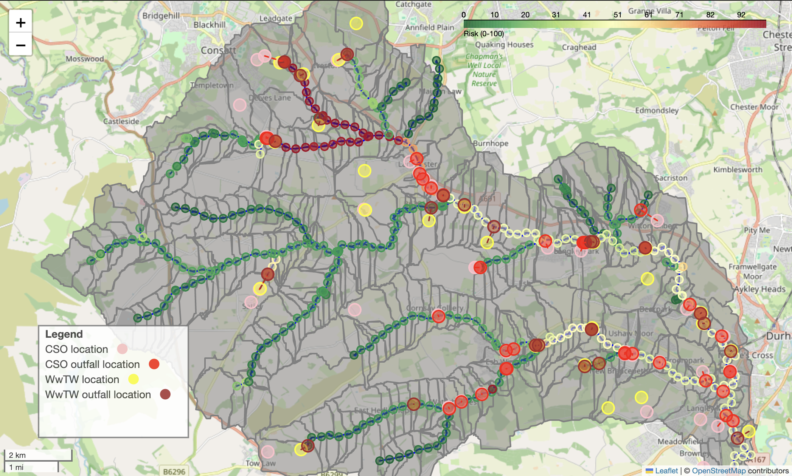

To address these challenges, River Deep Mountain AI(an Ofwat Innovation project) is providing a standardised and open approach to produce catchment-wide 'risk maps', helping to highlight areas where pollutants (e.g., phosphorus) pose a higher threat to river water quality. The Open Risk Map can be used to inform where further on-the-ground walkovers may be needed and highlight the optimal locations for targeting investigations, investment and monitoring.

## Identifying Important Pressures

To identify the most important pressures affecting river catchments in the United Kingdom, the Environment Agency’s (EA's) Reasons for Not Achieving Good Status (RNAGS) were examined. Specifically, how often the different RNAGS appear across England, as shown in the figure below. Those appearing more often were prioritised for inclusion in risk mapping. Whilst this analysis was undertaken only for England, there is not expected to be significantly different pressures in the other nations in the United Kingdom, (i.e. continuous sewage discharges and agriculture will likely feature in all nations, though the associated RNAGS may appear more or less frequently)

This building block focused primarily on catchment pressures that introduce priority pollutants to rivers, as a main objective of the building block is to inform the placement of water quality sensors. Therefore, some of the pressures shown in the figure are not applicable, such as ‘Other’, as they mostly impact river health by physically modifying the channel.

Summary of most frequently appearing Reasons for Not Achieving Good Status (RNAGS) across England.

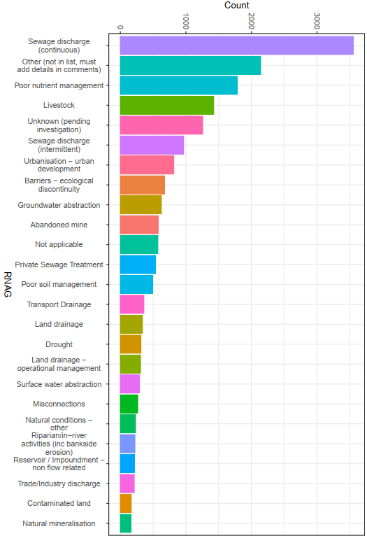

Out of these, the following RNAGs have been chosen to be implemented:

- Sewage discharge (continuous), i.e., Wastewater Treatment Works (WwTWs) final effluent discharges
- Sewage discharge (intermittent), i.e., Overflow spills
- Agricultural runoff
- Urban Runoff
- Private Sewage Treatment

These were chosen because they are frequently cited as RNAGS and the method for determining risk from these pollution sources somewhat overlaps. The pathway the potential pollutants take to the river network can also generally be identified.

## Water quality variables included

To identify water quality variables to focus on, the RNAGS data was analysed in more detail. The relative counts under which different water quality variables appear in the RNAGS for the pressures implemented in the risk maps were analysed.

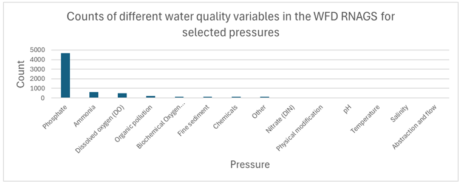

Phosphate appears most frequently in the RNAGS, followed by ammonia. Therefore, the two variables implemented in the risk maps at this stage are:

- Reactive Orthophosphate as P.
- Ammoniacal Nitrogen as N (the sum of $NH_4$ and $NH_3$).

It should be noted that data used in the risk maps and subsequent calculations of risks are based on the phosphorus (P) and nitrogen (N) components of reactive orthophosphate and ammoniacal nitrogen, respectively, as this is how these water quality variables are reported in the EA water quality database. This consideration is important when building any new risks and associated feature engineering into the risk maps. More specifically, using the example of reactive orthophosphate, the EA reports on the P part of $PO_4$. Therefore, when reporting the concentration of $PO_4-P$, the concentration of $PO_4$ has to divided by 3.06 (as the P part makes up around 1/3 of $PO_4$; this is based on the molecular weights of elements as described [in this website](https://castco.org/knowledge-base/overview-phosphorus/))

## Overview

The model calculates risk to a watercourse through the following methodology:

- Building a directed graph from the rivers and separating river reaches into segments separated by nodes (topological analysis)
- Ingesting data for the risk layers (these are the sources of pollution/risks)
- Mapping the closest point on the graph to each point source
- Delineating subcatchments for diffuse sources
- Estimating the quantity of pollutant generated by each pollution source (e.g., an overflow)
- Establishing where the pollutant enters the river network
- Estimating the flow of the river network at that node
- Calculating the dilution of a given pollutant in the river network (taking into account any pollutants arriving from upstream)
- Comparing the estimated concentration of the pollutant against relevant UKTAG/EQS standards to establish the relative risk at that node in the river
- Accounting for degradation of the pollutant in the river network (different pollutants degrade at different rates)
- Calculating a load for each source
- Using the load, distance, and flow to estimate a risk at each node in the graph

The risk from pollution sources is annualised, with the flow estimate used being the Q50 (flow rate equalled or exceeded 50% of the time). The flow is estimated according to the relationship between upstream accumulated length from the ORN and the Q50 of NRFA gauging points. The flow estimate is used as risk is estimated according to the UKTAG/EQS, which are for annual average values.
This process is implemented progressively using the [`RiskMap.py`](../RiskMap.py) class to perform these operations on a [NetworkX](https://networkx.org/) graph.

## Data Sources

The following section outlines the openly available data sources used for the risk mapping. There are alternative datasets that could be used to improve risk estimations, but typically these are not publicly available or incur a cost (such as [QUBE](https://www.hydrosolutions.co.uk/software/qube/) for river flow). Given the geographical scope of many of the data sources listed below, the model is limited to England, although the scope could be increased if equivalent data sources for other regions are identified.

Data download and transformation is handled by the [`get_and_transform_data.py`](../get_and_transform_data.py) file. The data is stored in the [data](../data/) directory.

### Rivers

- For rivers, the [Open River Network](https://openrivers.net/) (ORN) is used to give the river network.

- This map is composed of LineStrings which represent river reaches. The river reaches are generally ordered in flow direction (except for tidal rivers) and the river map is considered to be a directed graph.

- The lines are subdivided into a desired resolution to form the nodes of the graph (see [`split_rivers`](../utils/rivers.py)). At present, the resolution is set to 200 m.

### Overflow Data

- Overflow spill data comes from [EA Storm Overflows - Annual Returns](https://environment.data.gov.uk/dataset/21e15f12-0df8-4bfc-b763-45226c16a8ac).

- Each overflow has a unique ID and a Consent Permit Reference, which is used to match to the relevant permit in [EA Consents Database](https://www.data.gov.uk/dataset/55b8eaa8-60df-48a8-929a-060891b7a109/consented-discharges-to-controlled-waters-with-conditions1).

### Consents Data

- Consents data (for English WwTWs and overflows) comes from the [EA Consents Database](https://www.data.gov.uk/dataset/55b8eaa8-60df-48a8-929a-060891b7a109/consented-discharges-to-controlled-waters-with-conditions1).
- The relevant tables from this database are:
  - 'consents_active': This table contains the active consents with their permit number and location. The WwTWs are located using this table and it is also used to join permit numbers with the determinand.
  - 'determinands': This table contains the consented values of the determinands for a given permit number. This is where the conditions for consented final effluent phosphorus etc., are obtained.

### Land Use Data

- The land use data being used is the [CROME 2023 dataset](https://environment.data.gov.uk/dataset/a27312b5-d6c9-4710-ad5e-382d727c1b05).
- It consists of hexagons with each hexagon having a land use code which is converted to a crop category using [`data/crop_categories.csv`](../data/crop_categories.csv).

### Soil Data

The hydrology of soil types (HOST) is needed to estimate agricultural inputs of phosphorus and nitrogen. However, the UKCEH HOST dataset is not free and requires a licence. Therefore, in the interest of using open datasets, an alternative, open HOST dataset for the UK was obtained. The dataset is derived from the results of [this study](https://hess.copernicus.org/articles/11/1501/2007/). In the study, the Soil Geographical Database of Europe (SGDBE) was reclassified to derive the HOST classes. The authors were contacted and gave permission to share their generated shapefile, which is part of the repository. This data is stored in [`data/soil_host_data.zip`](../data/soil_host_data.zip).

### Rainfall Data

[UK Met Office Rainfall Data](https://www.arcgis.com/home/item.html?id=f6ed302049894ee8b230215a3efa9c19) is being used to obtain average annual rainfall across England. This is data sampled on a 12 × 12 km grid in terms of mm of rainfall per year.

### Topography Data

To delineate catchments and flow paths, the [elevatr](https://github.com/titouanlegourrierec/elevatr) library in Python is used, which pulls data from multiple sources to give elevation data.

### Ordnance Survey Data

For urban areas, data for buildings, roads and built-up area extent is required. [Ordnance Survey Data](https://www.ordnancesurvey.co.uk/) is used for this.

#### Roads and buildings

For roads and buildings, the [OS OpenMap - Local](https://www.ordnancesurvey.co.uk/products/os-open-map-local) is used.

#### Built-up areas

For the built-up area categorisation, the [OS Open Built Up Areas](https://www.ordnancesurvey.co.uk/products/os-open-built-up-areas) dataset is used.

### Farmscoper Data

For estimating agricultural and livestock runoff load, the [ADAS Farmscoper Tool](https://adas.co.uk/services/farmscoper/) is used. This data has been provided directly by ADAS and has been processed and kept in the [`data/`](../data/) directory. It consists of multiple lookup tables, which are used to estimate runoff load based on land use, soil type and rainfall.

## Data Flow

The flow chart illustrates the sources of data and how they are used to develop the risk map.

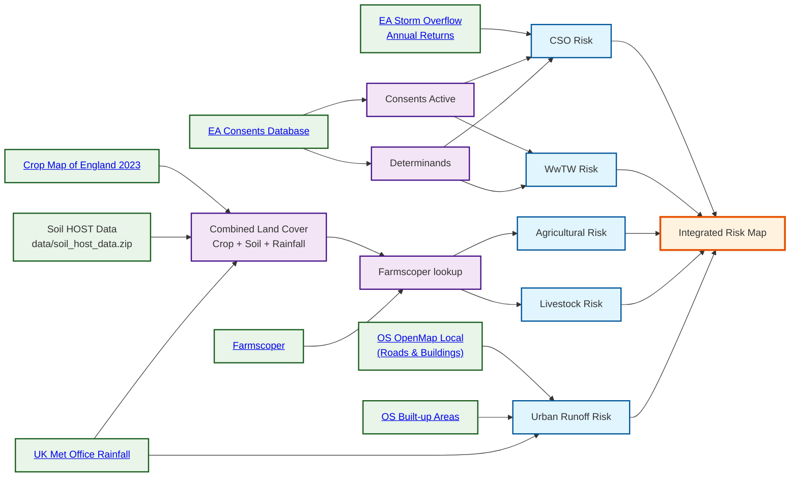
```mermaid
flowchart LR
    %% External Data Sources (Level 1) - All aligned left
    CSO_ANNUAL["<a href='https://environment.data.gov.uk/dataset/21e15f12-0df8-4bfc-b763-45226c16a8ac'>EA Storm Overflow<br/>Annual Returns</a>"]
    EA_CONSENTS["<a href='https://www.data.gov.uk/dataset/55b8eaa8-60df-48a8-929a-060891b7a109'>EA Consents Database</a>"]
    CROME["<a href='https://environment.data.gov.uk/dataset/a27312b5-d6c9-4710-ad5e-382d727c1b05'>Crop Map of England 2023</a>"]
    SOIL[Soil HOST Data<br/>data/soil_host_data.zip]
    RAINFALL["<a href='https://www.arcgis.com/home/item.html?id=f6ed302049894ee8b230215a3efa9c19'>UK Met Office Rainfall</a>"]
    OS_LOCAL["<a href='https://www.ordnancesurvey.co.uk/products/os-open-map-local'>OS OpenMap Local<br/>(Roads & Buildings)</a>"]
    OS_BUILTUP["<a href='https://www.ordnancesurvey.co.uk/products/os-open-built-up-areas'>OS Built-up Areas</a>"]
    FARMSCOPER["<a href='https://adas.co.uk/services/farmscoper/'>Farmscoper</a>"]
    %% Database Tables (Level 2)
    CONSENTS[Consents Active]
    FARMSCOPER_LOOKUP[Farmscoper lookup]
    DETERMINANDS[Determinands]

    %% Processed Data (Level 3)
    LAND_COVER[Combined Land Cover<br/>Crop + Soil + Rainfall]

    %% Risk Types (Level 4)
    CSO_RISK[CSO Risk]
    WWTW_RISK[WwTW Risk]
    AGRI_RISK[Agricultural Risk]
    LIVESTOCK_RISK[Livestock Risk]
    URBAN_RISK[Urban Runoff Risk]

    %% Final Output (Level 5)
    RISK_MAP[Integrated Risk Map]

    %% Data flows
    EA_CONSENTS --> CONSENTS
    EA_CONSENTS --> DETERMINANDS
    CROME --> LAND_COVER
    SOIL --> LAND_COVER
    RAINFALL --> LAND_COVER
    LAND_COVER --> FARMSCOPER_LOOKUP
    FARMSCOPER --> FARMSCOPER_LOOKUP

    %% To risk calculations
    CSO_ANNUAL --> CSO_RISK
    CONSENTS --> CSO_RISK
    DETERMINANDS --> CSO_RISK


    CONSENTS --> WWTW_RISK
    DETERMINANDS --> WWTW_RISK


    FARMSCOPER_LOOKUP --> AGRI_RISK
    FARMSCOPER_LOOKUP --> LIVESTOCK_RISK


    OS_LOCAL --> URBAN_RISK
    OS_BUILTUP --> URBAN_RISK
    RAINFALL --> URBAN_RISK


    %% Final integration
    CSO_RISK --> RISK_MAP
    WWTW_RISK --> RISK_MAP
    AGRI_RISK --> RISK_MAP
    LIVESTOCK_RISK --> RISK_MAP
    URBAN_RISK --> RISK_MAP

    %% Styling
    classDef dataSource fill:#e8f5e8,stroke:#1b5e20,stroke-width:2px
    classDef dbTable fill:#fff9c4,stroke:#f57f17,stroke-width:2px
    classDef intermediate fill:#f3e5f5,stroke:#4a148c,stroke-width:2px
    classDef riskCalc fill:#e1f5fe,stroke:#01579b,stroke-width:2px
    classDef finalOutput fill:#fff3e0,stroke:#e65100,stroke-width:3px

    class CSO_ANNUAL,EA_CONSENTS,RIVERS,CROME,SOIL,RAINFALL,OS_LOCAL,OS_BUILTUP,FARMSCOPER dataSource
    class CONSENTS,DETERMINANDS,FARMSCOPER_LOOKUP intermediate
    class FLOW,LAND_COVER intermediate
    class CSO_RISK,WWTW_RISK,AGRI_RISK,LIVESTOCK_RISK,URBAN_RISK riskCalc
    class RISK_MAP finalOutput
```

## Methodology

### Mapping the Point Sources of Pollution to Rivers

Since WwTW and overflow outfall locations are not always situated directly adjacent to the receiving watercourse, outfalls are mapped to the closest river. This is defined in the [`RiskMap.add_point_info_to_map()`](../RiskMap.py) method.

- A tolerance limit (threshold distance) is defined for mapping the outfall locations. This tolerance limit can be changed before running the model.
- The outfall locations are mapped to the closest edge on the river if they are within the tolerance limit (i.e., if the distance of an outfall from the nearest watercourse exceeds the tolerance limit, it will not be mapped), as a dashed line per the figure below, where a number of outfall locations are not mapped to a river reach (dashed line missing), as they are situated outside of the threshold.
- By default, the tolerance is set to 700 m, but this can easily be adjusted. The ORN represents each river as a LineString along its centre, and so there is no accounting for river width. 700 m tolerance allows for overflows neighbouring the largest rivers (e.g., Severn, Thames, which are $> 1000\ m$ wide at their mouths) to match to their respective LineString.

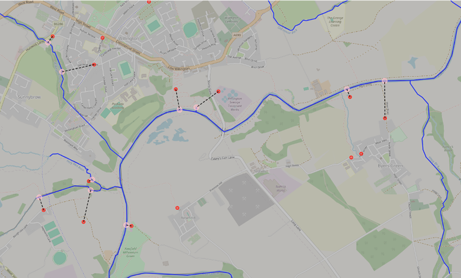

### Delineation of Catchments for Diffuse Sources

To estimate where the load from diffuse sources will enter the watercourse, subcatchments have been defined for each node in the risk map. This is done using elevation data obtained from [elevatr](https://github.com/titouanlegourrierec/elevatr) combined with a Python library called [whitebox-workflows](https://www.whiteboxgeo.com/whitebox-workflows-for-python/) (WB). This process is performed in the [`utils/catchment_delineation.py`](../utils/catchment_delineation.py) file.

- Elevation data is obtained from elevatr at a zoom level of $12$.
- WB is then to fill depressions in the elevation data, calculate flow direction and flow accumulation.
- The flow accumulation is then used to define the stream network, using a threshold of $1000$ cells.
- The stream network is then snapped to the RiskMap river network and the watersheds for every node are obtained, converted to vectors and saved.

Each node in the riskmap is not guaranteed to have a watershed, and some watersheds may be very small due to local topographical conditions. Therefore, a minimum area of $20,000 m^2$ ($2 ha$) is set for a watershed to be considered valid. If a watershed does not exist or is too small, it is merged with the watershed of the node downstream, and that watershed is considered to have more than 1 node inside. All the load from that 'combined' watershed is then split between the nodes equally. This process is implemented in the [`RiskMap.delineate_catchments()`](../RiskMap.py) method. Seen below, the highlighted subcatchment in yellow corresponding to the nearest river network node is smaller than the minimum area, so it is merged with the downstream catchment to form the bigger subcatchment in red.

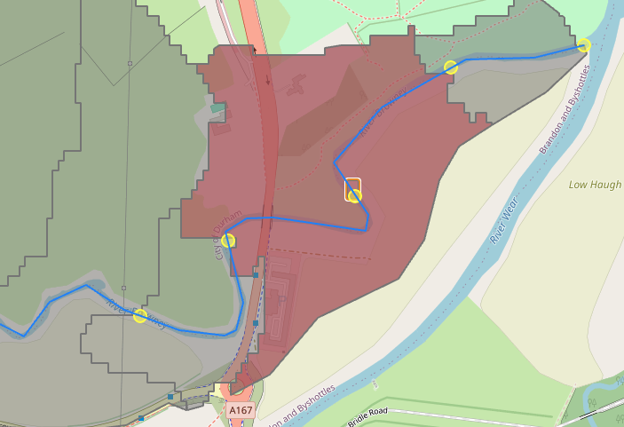

Once a load is obtained for a subcatchment, it is assigned back to the river network. This is done in the [`RiskMap.catchment_to_river_load()`](../RiskMap.py) method. Then, using these load values, this load is progressively accumulated downstream, which is done using the [`utils/graph.add_diffuse_risk()`](../utils/graph.py) method, which takes these load values, accumulates them, decays them according to a pollutant specific decay rate, and converts them to concentrations using the river flow values.

### Calculating a Risk Value

The risk mapping calculates a static estimate of risk for each river node for latest available datasets, i.e., it does not consider changes in risk seasonally across the year. Therefore, the estimate of risk is a representative average for across a year. This approach was taken as a significant increase in complexity would be required to assess (for instance) seasonal risk, and there is insufficient open data available to do this. This also means that the risk maps will need to be periodically re-created with updated data to account for changes in risk metrics.

#### Conversion of concentration to Risk

After obtaining the estimated yearly average active pollutant load, this is converted into a concentration at every point.

$$C_P(mg/l) = \frac{\sum{Load_P}}{Flow\ rate}$$

Where $C_P$ is the concentration of pollutant $P$, $\sum{Load_P}$ is the sum of all loads of pollutant $P$ entering the river upstream of that point (including any degradation).

Once this concentration is calculated, it is converted to a risk value using the [UKTAG Revised standards for poor river health](https://www.wfduk.org/sites/default/files/Media/UKTAG%20Phosphorus%20Standards%20for%20Rivers_Final%20130906_0.pdf):

$$Risk_P = \frac{C_P}{C_{UKTAG}} \times 100$$

For Phosphorus, the UKTAG standard is $0.87 mg/l$ for a river to be classified as 'Poor' status. The UKTAG standards are categorised by site elevation and alkalinity. The value of $0.87 mg/l$ was derived as the average across all the Lowland/Upland alkalinity site categories.

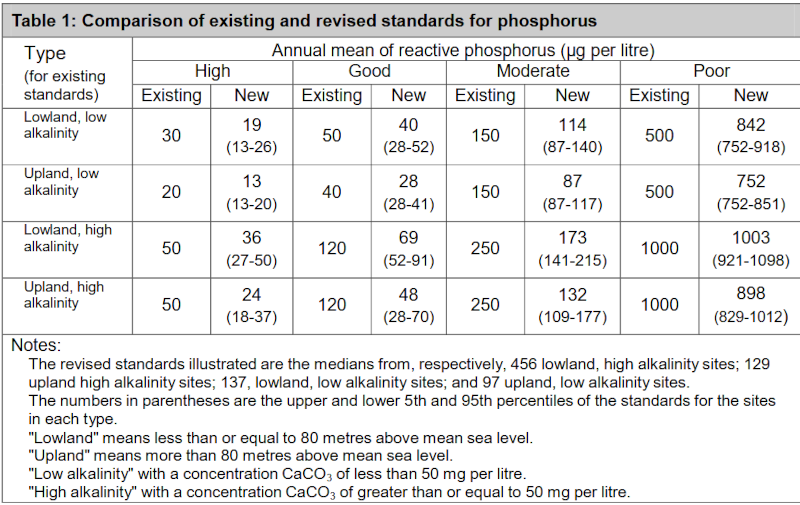

Since there is no UKTAG standard for Ammoniacal Nitrogen, the highest WFD 99th percentile standard among the different WFD status categories (Poor category) and water body types (3, 5 or 7) of $6.0 mg/l$ was used. Please note, the WFD 99th percentiles are for ammonia as N.

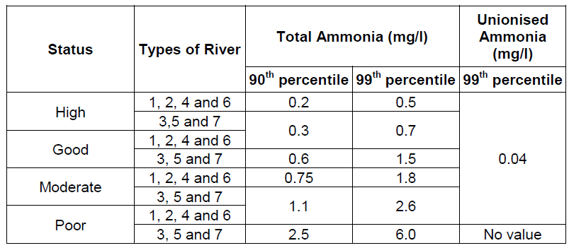

After obtaining the risks for different pollutants, they can be combined into a single risk value. This is done by taking the average of all the risk values, but can in principle be weighted as desired.

#### Risk Degradation

The breakdown of a pollutant is also modelled at the same time as propagating it downstream for point and diffuse sources. Pollutant breakdown is modelled as an exponential decay with regards to time, calculated using velocity and distance.

$$c = c_0e^{-\frac{kx}{u}}$$

Where $c_0$ is the initial concentration, $k$ is the decay rate, $x$ is the distance between nodes and $u$ is the flow velocity of the river.

For reactive orthophosphate, the degradation rate is obtained from WRc's in-house integrated catchment model [SIMPOL-ICM](https://www.wrcgroup.com/services/simpol-integrated-catchment-modelling-for-water-quality/) $(0.05 d^{-1})$ and adjusted for a summer water temperature of $(16^{\circ}C)$ to give an adjusted decay rate of $(0.04d^{-1})$. For Ammoniacal N, a decay rate ($0.42 d^{-1}$) is similarly obtained.

Flow velocity was assumed to be constant and calculated using an equation with a simplified trapezoidal representation of a channel profile. Flow levels corresponding to Q50 (flows equalled or exceeded 50% of the time) were examined for gauged points in five case study catchments representative of different geographical regions of England, based on measured values available in the Hydrological Data Explorer. The Q50 water levels (m), river slopes, and river widths for the five catchments were input into the equation assuming a [Manning's roughness](https://pubs.usgs.gov/wsp/2339/report.pdf) coefficient of 0.03. The calculated flow velocities ranged from 0.47 m/s to 1.04 m/s, and an average flow velocity of 0.77 m/s was adopted.

The exponential decay is implemented in [`pollutant_parameters/P_values`](../pollutant_parameters/P_values.py) and [`pollutant_parameters/NH4_values`](../pollutant_parameters/NH4_values.py).

#### River Flow

River flow is key to understand the dilution capacity of the river at a particular point. A linear approximation with upstream accumulated length (present in ORN) is taken for Q50 flow. This was obtained using a linear regression of flow from [NRFA gauging sites](https://nrfa.ceh.ac.uk/data/search), compared with the nearest point on the ORN. A summary of the regression results is below.

The statistical summary shown indicates that upstream accumulated length (`x1`) from the ORN has a strong relationship with Q50. Adding annual mean rainfall as an independent variable to the regression relationship did not significantly improve the $r^2$ of the regression.

This approximation of Q50 is simplistic and was adopted for convenience and to limit demands of the risk mapping on computational resources as such the uncertainty associated with these flow values will be high. The above flow approximation could be replaced with better approximation of flow if available and required, such as [QUBE](https://www.hydrosolutions.co.uk/software/qube/).

The method is implemented in the [`utils/rivers.linear_flow()`](../utils/rivers.py) function.

### Load from different sources

#### Load from WWtW and Overflows

For pollutant load from water company assets, permit conditions are used to estimate flow and load. As is [common practice](https://www.ciwem.org/assets/pdf/Special%20Interest%20Groups/Urban%20Drainage%20Group/Guide-to-the-Quality-Modelling-of-Sewer-Systems.pdf) for water quality modelling, an event mean concentration is used for pollutants.

The separation of consents into overflows and the mapping of annual overflow spill data to the consents data is performed in the [`get_and_transform_data.py`](../get_and_transform_data.py) file while importing the data. This data is used in the [`utils/consentsRisk.py`](../utils/consentsRisk.py) file to map IDs to a Risk value.

##### Combined Sewer Overflows (CSOs)

While not all overflows are CSOs, they are commonly referred to as such, and we will carry forth this convention.

###### Reactive Orthophosphate Load

- Overflows do not usually have permit conditions for pollutants; therefore, an estimate had to be made.
- Overflow discharges are not normally considered to contribute significantly to reactive orthophosphate in watercourses (for instance see the Environment Agency's [source apportionment for the Wye](https://engageenvironmentagency.uk.engagementhq.com/focus-on-phosphorus)), with their impact on dissolved oxygen more significant.
- The concentration of reactive orthophosphate in overflow effluent for the purposes of this project is estimated to be $3\,mg/l$.
  - This is based on analysis of the Environment Agency's Water Quality Archive (2000-2024), which indicated a mean reactive orthophosphate P value of $2.42\,mg/l$ and a median of $1.29\,mg/l$ for storm sewage overflow discharge samples (n=674, 243 sites).
    
- This value may appear fairly low, considering some WwTW permit conditions for total phosphorus are greater than $3 mg/l$, but overflow discharges are generally diluted by run-off:
  - Normal guidance for setting pass forward flow (PFF) values for overflows is roughly 3 x dry weather flow (3DWF) for settled overflows (i.e. storm tanks) and 6 x dry weather flow (6DWF) for non-settled overflows. The overflow discharge occurs after these PFF values have been exceeded.
  - It would therefore be expected that overflow discharges are diluted untreated sewage (notwithstanding where PFF permit conditions were set before significant upstream development has increased DWF).
  - [Literature](https://www.sciencedirect.com/science/article/abs/pii/0043135476900932) suggests that _per Capita_ production of total phosphorus is around $1.8 g/day$. [Assuming an average _per Capita_ consumption](https://database.waterwise.org.uk/wp-content/uploads/2019/10/WWT-Report-.pdf) of water of $141 l/day$, this gives an average concentration of $12.5 mg/l$ of **Total Phosphorus** in raw sewage (depending on infiltration etc.).
  - Given that this $12.5 mg/l$ should be diluted by between 3 and 6 times before discharge, $3 mg/l$ seems a sensible estimate for reactive orthophosphate in overflow discharges.
- It should be noted that further quality checks on the EA's WQ data have not been undertaken; the data used includes all sampling purposes (e.g., compliance audits, unplanned and planned monitoring). No account has been made for weather conditions (and therefore dilution of foul flow) at the time of sampling.

###### Ammoniacal Nitrogen Load

- As mentioned previously, permit conditions for overflow pollutants donot usually exist, so an estimate of overflow ammoniacal nitrogen had to be made.
- The concentration of ammoniacal nitrogen in overflow effluents is estimated to be $13 mg/l$, based on an analysis of the Environment Agency's Water Quality Archive (2010-2024).
- This is based on the mean for storm sewage overflow discharge samples (n = 254)
- Further quality checks on the EA's WQ data have not been undertaken and the data used include all sampling purposes, with no account for weather conditions at the time of sampling.

  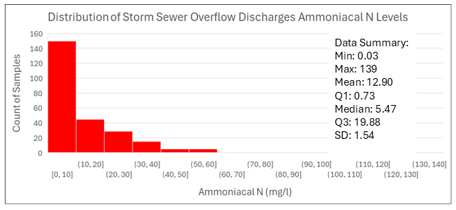

###### Volume

- Current overflow monitoring (Event Duration Monitoring) in the UK is generally limited to duration of spill (and spill count, which uses the Environment Agency's [12/24 counting method](https://www.gov.uk/government/publications/water-companies-environmental-permits-for-storm-overflows-and-emergency-overflows/water-companies-environmental-permits-for-storm-overflows-and-emergency-overflows#counting-spills)). To understand the risk to watercourses posed by overflows, an estimate of spill flow rate had to be made:
  - Flow is obtained from the **Weir Setting** or **Flow to Full Treatment** given in the permit conditions.
  - Where no weir setting was specified, a value of $20 l/s$ was assumed.
    - This $20\ l/s$ value is a placeholder. Weir settings range from less than $1\ l/s$ to over $27,000\ l/s$ (at Beckton WwTW in London). _Generally_ , an overflow without a weir setting would be expected to be on the smaller side of this (or permitted to only spill in an emergency), but there is no easy approximation without detailed analysis of sewer records (which are not publicly available). It should also be noted that the EA consent database provided may not contain all information from consents – a number of weir settings are not in the EA consent database but are in the “raw” consent documents.
  - The weir setting was assumed to be the average rate of spill for the overflow (i.e. an overflow with a 10 l/s weir setting would be expected to spill 10 l/s on average).
- This method assumes that an overflow with a larger permit setting spills a larger volume. This is a fairly coarse assumption, but estimates of overflow spill volumes are not readily available.
  - To validate this method, a limited check was made of spill volumes and flow rates predicted by hydraulic models (though not specifically calibrated to predict overflow spills) and of ‘flow to storm’ telemetred flow.
  - The results were highly variable, but indicated that the 1:1 weir setting:spill volume ratio may overestimate spill volumes, with spill volumes _tending_ to be lower than the weir setting (dependent obviously on the size of the storm). However, given the very low sample size and confidence in the flow and hydraulic model data, it was decided that a 1:1 ratio was probably an acceptable assumption. **Supporting data for this is not provided as it is not publicly available**.

###### Load Estimation from CSO Overflows

- To estimate the yearly average load (noting average spill rate is equivalent to weir setting): 

  $$P_{load}(mg/s) = 3 mg/l * weir\ setting (l/s)$$
  $$Ammoniacal N_{load}(mg/s) = 13 mg/l * weir\ setting (l/s)$$

- And subsequently multiplied by the spill duration to acquire the average load.

  $$Load_{avg}= Load(mg/s) \times \frac{Spill\ duration(s)}{365 \times 24 \times 60 \times 60}$$

This value can then be divided by the estimated Q50 flow value to obtain the average concentration (noting that Q50 values are in $m^3/s$).

##### Wastewater Treatment Works (WwTWs)

###### Reactive Orthophosphate Load

- Treated sewage (final effluent) is normally consented for total phosphorus, which for risk modelling has been converted to reactive orthophosphate P.
- A linear approximation was used to convert total phosphorus to reactive orthophosphate P (see [`pollutant_parameters/P_values.py`](../pollutant_parameters/P_values.py)):
  $$P_{Reactive} = P_{Total} * 0.785$$
  - This figure was derived from the Environment Agency's Water quality data archive.
  - For "final effluent" sample types, the total phosphorus samples were joined with their corresponding reactive orthophosphate P samples. Samples taken at the sample point and time were assumed to be the same sample.
  - Any samples were removed that were outside of the detection threshold for either total phosphorus or reactive orthophosphate P. Any samples where reactive orthophosphate P exceeded total phosphorus were also removed (as this is physicall not possible, and therefore the data is not trusted).
  - A linear model with an intercept forced to 0 was fitted to the transformed paired results. The results of this linear model are presented below, alongside a graphical representation of the results (n = 8,167).

    
    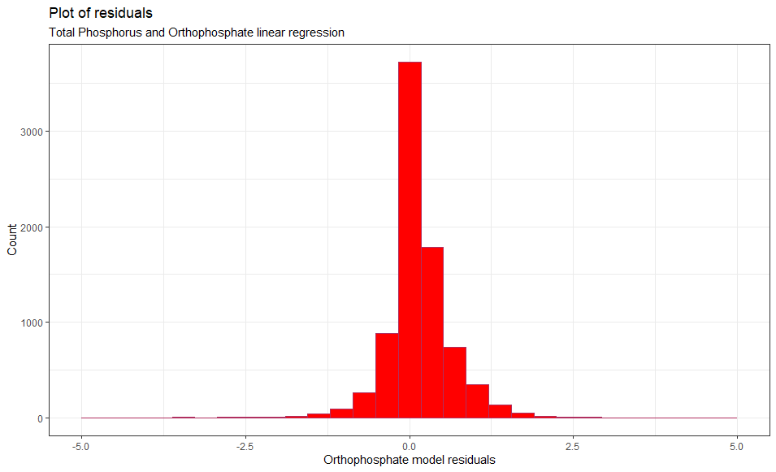
    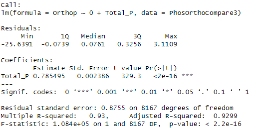

- Not all WwTWs currently have permit conditions set for phosphorus treatment and in such cases they would not be expected to have phosphorus treatment in place. A value of $5 mg/l$ is used where no phosphorus permit conditions are set. This value was obtained by taking an average of the EA's reactive orthophosphate final effluent samples ($4.94 mg/l$, n = 354,370). These data are primarily from pre-2010 and are summarised below. This value also ties in well with [OFWAT's PR24 performance commitments](https://www.ofwat.gov.uk/wp-content/uploads/2024/12/River-water-quality-_-FD-PC-definition.pdf).

  

###### Ammoniacal Nitrogen Load

- The consented value for Ammoniacal nitrogen of final effluent was used for WwTWs which currently have permit conditions set.
- For WwTWs without a final effluent consent for Ammoniacal nitrogen, a value of $2.6 mg/l$ was used.
- This value of $2.6 mg/l$ was the mean of Ammoniacal nitrogen in the EA's Water Quality Archive for final effluent samples (2010-2024; n = 276362; median = 0.6; SD = 8.068; min. = 0; max. = 1490; Q1 = 0.24; Q3 = 2.11).

###### Volume

- The flow/volume of treated effluent is estimated from the Dry Water Flow (DWF) condition in the permit.
  - Most WwTWs have a permit condition for DWF. A value of $20 m^3/day$ is used in the absence of information. A manual check of these sites tended to indicate that they were small, serving only small catchment areas with limited incoming flow.
  - $20 m^3/day$ has been used as this is the upper discharge limit of a 'Standard Rules' permit [as described by the Environment Agency](https://www.gov.uk/guidance/discharges-to-surface-water-and-groundwater-environmental-permits#apply-for-a-standard-rules-permit). The usage of $20 m^3/day$ could therefore be described as reasonably conservative as many of these sites could be discharging less than this.
- The values used for estimating WwTWs final effluent risk could be improved by using _measured_ treated effluent values rather than permit limits, and by incorporating _actual_ phosphate measurements for a WwTW. However, neither of these values were readily available at the time of initial release of this model (though some water companies do publish treated effluent volumes, and water companies are required to report their treated effluent volumes to the EA for any site treating > $50 m^3/day$).

###### Load Estimation from WwTWs

- To estimate the yearly average load:

  $$P_{avg} = (WwTW\ Total\ Phosphorus\ Permit\ Condition * 0.785\ or\ 5 mg/l) * DWF\ Permit\ (or\ 20 m^3/day) $$

  $$Ammoniacal\ N_{avg} = (WwTW\ Ammoniacal\ N\ Permit\ Condition\ or\ 2.6 mg/l) * DWF\ Permit\ (or\ 20 m^3/day) $$

This value can then be divided by the estimated Q50 flow value to obtain the average concentration after unit coversion(noting that Q50 values are in $m^3/s$).

##### Private Treatment Works

Using the Consents database, the Private Treatment Works have been added to the wastewater treatment works. These are treated in the same way as WwTWs. There are 2 types of Private Treatment Works:

- Domestic Property (single) : These are small treatment works which serve a single property. These are assumed to have a DWF of $0.8 m^3/day$. This value was derived as the median of the dry weather flow consents (mean = 1.72; SD = 3.64; min. = 0; max. = 35, n = 361). Since they are assumed to not have specific treatment for phosphorus and ammonia removal, the same fill values for unpermitted works are used (as for the unpermitted water company WwTWs).
- Domestic Property (multiple): These are larger treatment works which serve multiple properties. The mean of the dry weather flow of the consents was used of $7 m^3/day$ (mean = 450; SD = 1,462; Min. = 0.3; Max. = 9300; n = 133). Again, the same fill values for unpermitted works are used since they are assumed to not have specific treatment for phosphorus and ammonia removal.

#### Load from Land Use and Livestock

For agriculture and land use, [ADAS Farmscoper Tool](https://adas.co.uk/services/farmscoper/) is used to estimate runoff load based on land use, soil type and rainfall. This is implemented in the [`utils/agricultureRisk.py`](../utils/agricultureRisk.py) file.

The Farmscoper tool was used to produce a lookup table which gives the runoff load for all relevant combinations of land use, livestock, soil type (HOST soil classes) and rainfall. The tool was also used to determine the excretal N from livestock for each WFD waterbody, based upon the 2019 agricultural census data in Farmscoper v5.

The land use, soil type and rainfall are determined for the subcatchments contributing to each node. This is done in the [`get_and_transform_data.get_land_cover_data()`](../get_and_transform_data.py) method.

- The land use data is obtained from the [CROME 2023 dataset](https://environment.data.gov.uk/dataset/a27312b5-d6c9-4710-ad5e-382d727c1b05). It consists of hexagons with each hexagon having a land use code which is converted to a farmscoper `crop_category` using [`data/crop_categories.csv`](../data/crop_categories.csv).
- The rainfall data is then spatially joined to the land use data and classified into a `rainfall_category` according to the farmscoper tool. This goes as:

  | Annual rainfall(mm) | `rainfall_category` |
  | ------------------- | ------------------- |
  | > 1500              | 5                   |
  | Between 1200 & 1500 | 4                   |
  | Between 900 & 1200  | 3                   |
  | Between 700 & 900   | 2                   |
  | Between 600 & 700   | 1                   |
  | < 600               | 0                   |

- Soil data (HOST soil classes) is also joined to this data and the farmscoper `soil_category` is subsequently obtained by using a lookup table in [`data/soil_lookup.csv`](../data/soil_lookup.csv).
- Finally for each polygon, the closest distance to its corresponding river segment in the river network which is part of the subcatchment where it drains is calculated using the catchment delineation done previously.

##### Land Use

For the land use load, this table is combined with the Farmscoper derived lookup table [`data/agriculture_load_lookup.csv`](../data/agriculture_load_lookup.csv) to obtain the load for each polygon in $kg/m^{2}/year$. This is multiplied by the area and to get the load from that particular polygon which is then converted to $g/s$.

##### Livestock

- The crop categories are further classified into `Grass`, `Rough` or `Arable`.
- The catchment number is overlaid on each polygon and the farmscoper derived **excreta** ($kg/ha/year$) for each `livestock_category`(specified in [`data/livestock_lookup.csv`](../data/livestock_lookup.csv)) is estimated using the lookup table [`data/livestock_excreta.csv`](../data/livestock_excreta.csv).
- This excreta is multiplied by the area of the polygon to get the **excreta load**($kg/year$) from that polygon.
- The load of the pollutant is then obtained using the lookup table [`data/livestock_excreta_load.csv`](../data/livestock_excreta_load.csv) which gives the **pollutant load** in $kg/year$ for each `livestock_category`. This is then converted to $g/s$.

For each of these polygons, another parameter is present along with the load called `Pathway`

- `Pathway=0` is the part of the load which travels via subsurface pathways or groundwater and does not decay with distance.
- `Pathway=1` is the part of the load which goes through surface runoff and a distance scaling is implemented for this load which goes like:

  $$l_d = l_0 e^{-\frac{d}{100}}$$

  Where $l_0$ is the initial load, $d$ is the distance to the river point in meters and $l_d$ is the decayed load.

The final load for a subcatchment is then obtained by summing up the land use and livestock loads across all the different polygons.

#### Urban Runoff

Urban run-off can be a significant pollution source. Run-off from urban sources tends to be high in heavy metals such as zinc and copper, or contaminated with polycyclic aromatic hydrocarbons (PAH) such as benzo[*a*]pyrene (amongst a host of other contaminants). The risk posed by phosphorus and ammonia from urban run-off is comparatively low, though in some urban watercourses may be significant.

For urban runoff, [Ordnance Survey Open Data](https://osdatahub.os.uk/downloads/open) is used to obtain built up area extent (dataset "OS Open Built Up Areas") and impervious areas (dataset "OS OpenMap - Local"), before processing them to establish urban run-off risk. This is implemented in the [`utils/urbanRisk.py`](../utils/urbanRisk.py) file.

The total area of the urban area in a subcatchment was calculated and annual rainfall used to estimate the runoff volume. An event mean concentration was then used to estimate the load in this runoff volume[^3][^4][^5]. Not all rainfall falling on urban areas leads to runoff reaching the river, with: $15-25\%$ typically is lost as evaporation, infiltration or vegetative interception. However, we have not made an account for this.

[^3]: R. J. Winston and W. F. Hunt, [Characterizing Runoff from Roads: Particle Size Distributions, Nutrients, and Gross Solids](https://ascelibrary.org/doi/abs/10.1061/%28ASCE%29EE.1943-7870.0001148)

[^4]: M. Kayhanian and C. Suverkropp and A. Ruby and K. Tsay, [Characterization and prediction of highway runoff constituent event mean concentration](https://www.sciencedirect.com/science/article/pii/S0301479706003264)

[^5]: Jy S. Wu and Craig J. Allan and William L. Saunders and Jack B. Evett, [Characterization and Pollutant Loading Estimation for Highway Runoff](https://ascelibrary.org/doi/abs/10.1061/%28ASCE%290733-9372%281998%29124%3A7%28584%29)

##### Roads

- Using the built up areas, roads were classified as `urban` or not.
- Roads were also classified as river trunk roads by whether they lie within a $200m$ distance of a river.
- As Ordnance Survey data (in this database) represents roads as linestrings with no width, road width was calculated using the classification of the road. This is a lookup table in [`data/road_width_lookup.csv`](../data/road_width_lookup.csv). Road widths are obtained by mapping the Ordnance Survey road classifications alongside OpenStreetMap in GIS. Then, for each road classification, samples of up to ten roads were identified. These roads were then viewed in Google Earth, and the line path tool was used to estimate the widths of the roads. The averages across the ten samples for each classification is then listed in the lookup table.

- The load can then be estimated by multiplying the total area of the roads with the annual rainfall and the event mean concentration.
  - For reactive orthophosphate, a road runoff value of $0.1 mg/l$ is used for both urban and rural roads which are river trunk roads.
  - For Ammoniacal N, a road runoff value of $0.8 mg/l$ is used for urban roads and $0.65 mg/l$ is used for rural trunk roads.
  - The above values are based on existing literature measuring Mean Event Concentrations of nutrients from rural and urban highways/roads, as well as unpublished data provided by [David Werner](https://www.ncl.ac.uk/engineering/staff/profile/davidwerner.html) of Newcastle University. The data provided by David Werner were monitored nutrient concentrations of three surface water drains in the Great Park area of Newcastle, and the river Ouseburn at the rural/urban boundary just upstream of these surface water drains.

##### Buildings

- The Built up areas dataset was used to classify buildings by whether they are urban or not. Only urban buildings are used for estimating load. It has been assumed that the majority of rural buildings will drain to soakaways (this is a broad assumption, and is demonstrably not the case everywhere). 
- Since buildings are represented as polygons, their area can be directly calculated.
- The load is then estimated by multiplying the total area of the buildings with the annual rainfall and the event mean concentration.
  - For reactive orthophosphate, a building runoff value of $0.1 mg/l$ is used.
  - For Ammoniacal N, a building runoff value of $0.8 mg/l$ is used.
  - These values are based on monitoring of nutrient concentration runoff in a study by Georgios and Vassilos[^6]. For Ammoniacal N, the value is based on that chosen for urban runoff, as the value in the paper seems exceedingly high. 

[^6]: Gikas, Georgios D and Tsihrintzis, Vassilios A, [Effect of first-flush device, roofing material, and antecedent dry days on water quality of harvested rainwater](https://link.springer.com/article/10.1007/s11356-017-9868-6)

The final loads are obtained by similarly summing the loads in a subcatchment and converting them to $g/s$.

##### A Note on Event Mean Concentrations used in road and urban runoff of ammonia

It should be noted that event mean concentrations for road and urban runoff available in the literature and from David Werner for ammonia were for ammonium nitrogen ($NH_4-N$), whereas the risk for ammonia in the risk mapping is expressed as ammoniacal nitrogen (the sum of $NH_4$ and $NH_3$). The relative proportions of $NH_4$ and $NH_3$ are predominantly dependent on pH, with the proportion of $NH_3$ increasing with increasing pH. Under a near-neutral pH, the ammonia can be expected to be dominated by $NH_4$ and the proportion of $NH_3$ to be insignificant. Therefore, it is assumed that event meant concentrations for ammonium nitrogen can be used to calculate ammoniacal nitrogen loads from roads and urban areas.

## Validation

Effectively, this risk map is a simplistic source apportionment tool. The validation is not expected to give results similar to water quality models. The purpose of the validation is to show areas where the model performs well, and areas where it could be improved.

The validation is performed by comparing the risk map predicted concentrations with observed concentrations from measurements.

- For reactive orthophosphate P, the Environment Agency's [Water Quality Archive](https://environment.data.gov.uk/water-quality/view/landing) is used. The mean of the determinand `Orthophosphate, reactive as P` is used to compare against the risk map predicted concentrations. The data used to calculate measured mean concentration was selected from the period 2017 to 2024 since the measurements are sparse.
- For Ammoniacal N, the Environment Agency's [Hydrology Data Explorer](https://environment.data.gov.uk/hydrology/explore) is used. The mean of the `Ammonium` measurements is used to compare against the risk map predicted concentrations. It should be noted that the EA's high-frequency sonde measurements of ammonium are reported as $NH_4-P$, so there was no need for a conversion to be applied before validation. The data is selected after 2024. This dataset reports ammonium at hourly intervals. It is assumed that ammonium ($NH_4$-N) will dominate Ammoniacal N under the typical pH of English rivers (averaging 7.8) and under temperatures cooler than room temperature. So, while a small proportion may exist as ($NH_3$-N), it's likely below 10%. Accounting for the balance between ionised and unionised ammonia would require some estimation of pH and a temporal resolution of at least seasonal to account for temperature changes.

Graphs plotting the predicted vs the mean of the measured concentrations are generated to see the overall trend. Risk Maps for each catchment are also generated to visualise spatial trends. The triangular points on the Risk Maps are the sampling locations and the colour of the points represent the mean of the samples, which is easy to compare against the colour of the risk map in the background to see if the model is over predicting or under predicting. An example RiskMap for Active P is shown below for the [Brock and Trib](https://environment.data.gov.uk/catchment-planning/OperationalCatchment/3051) catchment:

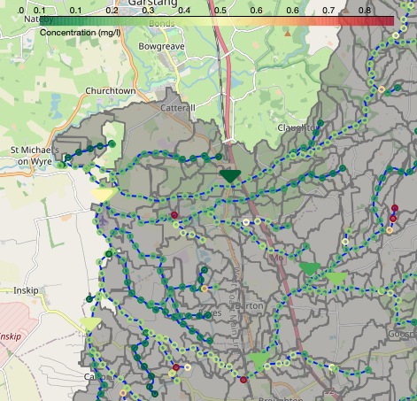

One of the main reasons for big differences between predicted and measured values is that there are very large WwTWs and overflows where permit conditions do not exist in the EA Consents database. This leads to a very large overestimation of load (some of the Dry Water Flows can be $~11,800 m^3/day$) since higher concentrations are used for unpermitted works. These can be manually checked and adjusted if required. It has also been identified that some WwTW and overflows have specified phosphorus or ammonia consents in the raw consent files but these have not been carried through to the EA's database.

### Reactive Orthophosphate P

For reactive orthophosphate P, 11 catchments were chosen across England to validate the model. These catchments were selected to:

1. Have sufficient EA measurements of Active P
2. Be broadly representative of the grographical regions of England

These are:

| Operational Catchment Name        | River Body Name  | Management Catchment Name |
| --------------------------------- | ---------------- | ------------------------- |
| Brock and Trib                    | Wyre             | North West                |
| Dee Lower Chester Weir to Ceiriog | Dee              | Dee                       |
| Eamont                            | Eden and Esk     | Solway Tweed              |
| Eden Lower                        | Eden and Esk     | Solway Tweed              |
| Eden Upper                        | Eden and Esk     | Solway Tweed              |
| Avon Hampshire                    | Avon Hampshire   | South West                |
| Till River                        | Till             | Solway Tweed              |
| Suffolk Coastal                   | Suffolk East     | Anglian                   |
| Test Upper and Middle             | Test and Itchen  | South East                |
| Wensum                            | Broadland Rivers | Anglian                   |
| Wyre and Calder                   | Wyre             | North West                |
| Yealm                             | Tamar            | South West                |

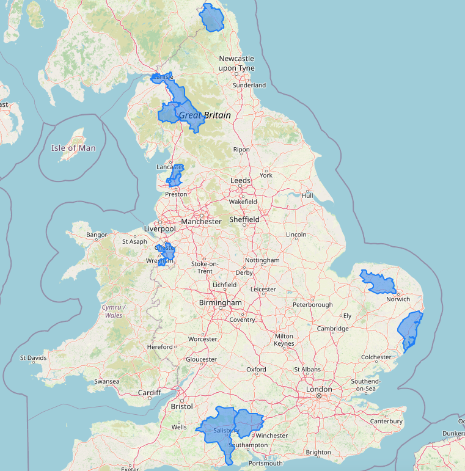

The model predictions of the concentrations of reactive orthophosphate P (132/209 observations). The overestimations of orthophosphate P in the former are be expected, as the EA monitoring data is very sparse, and the chance of collecting a sample during or just after a storm event (when concentrations are likely to be higher) is lower. The underestimation of orthophosphate P in the latter could be linked to the limitation in flow prediction in the model – over-estimations of flow by the model drive estimated orthophosphate P concentrations down because of extra dilution. Plotting the predicted vs measured concentrations for points where there are $>20$ observations for all the 11 catchments gives the following results:

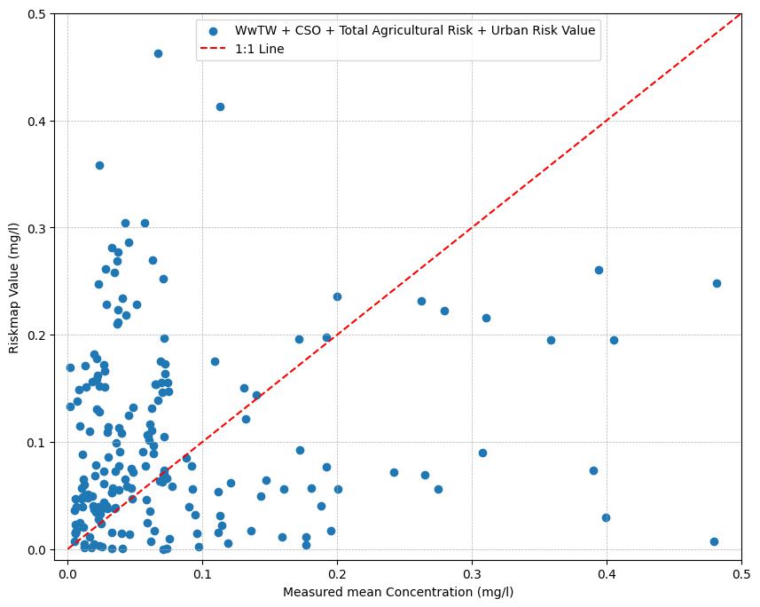

#### Case Study - Avon Hampshire

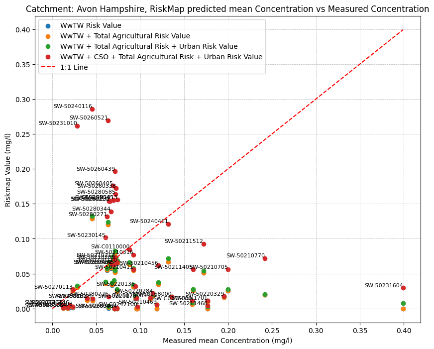

The model is both over predicting and under predicting reactive othophosphate P in many areas. However, it should noted that most of the concentrations are $< 0.2 mg/l$, which would be a low risk in the risk mapping, so the impact of this over/under-prediction on relative risks along a river reach should be fairly limited.

Checking the time series for one of the sampling locations where the difference between the observed and predicted was large, the model is over-estimating both the overflow Risk and the WwTW Risk, while the estimated risks from agricultural and urban areas are negligible. There is also another sensor downstream for which the risk is overestimated which can be seen on the map.

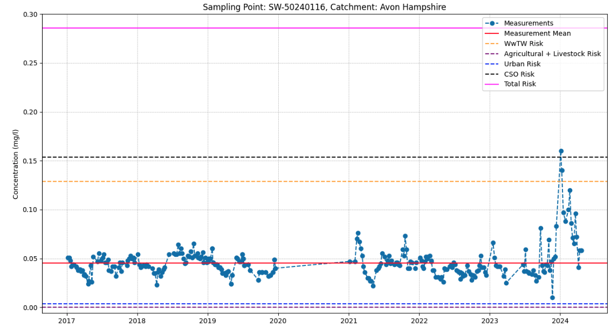

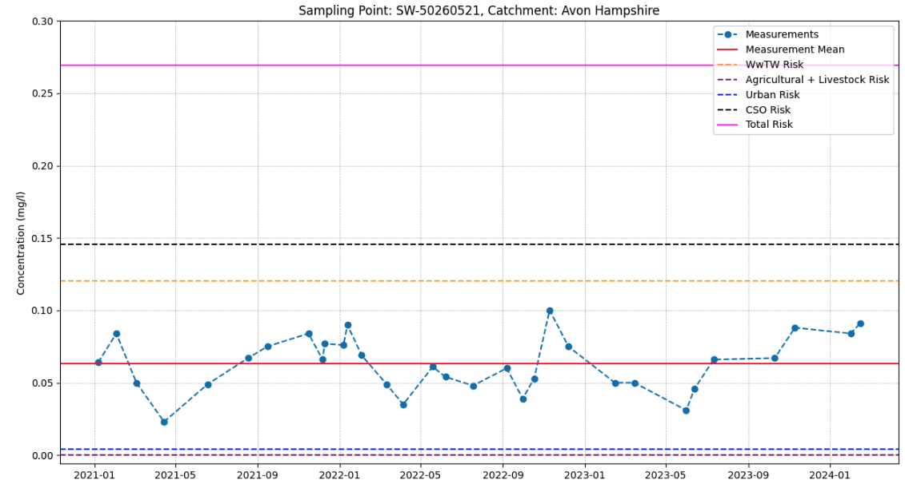

In the extract of the risk map below, the two triangles visible in darker green in the centre, represent the measurement mean, and the smaller, lighter green circles represents the risk map prediction. The whole river section has a high risk because of the consent not existing for a WwTW and the CSO weir setting being high.

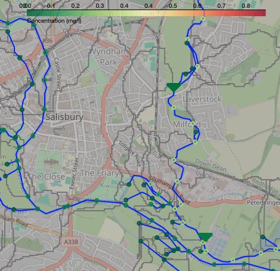

#### Case Study - Eden Lower

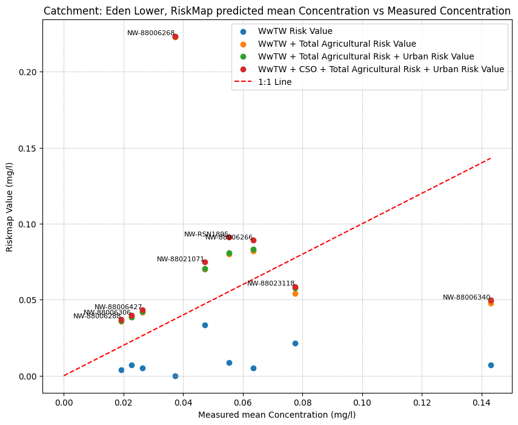

The model is quite well in agreement for Eden Lower. Most of the points having a higher number of measurements align quite well with the prediction.

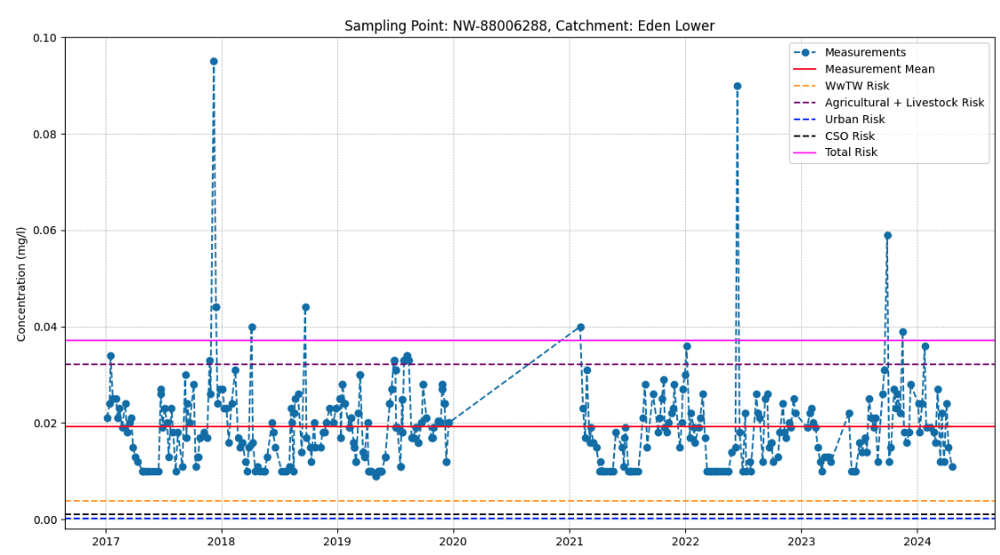

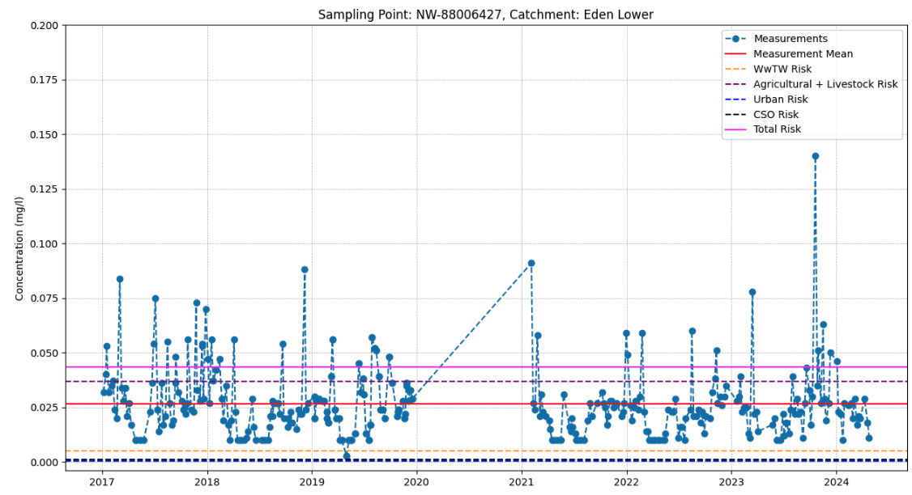

However, there are a couple of outliers which are due to an overestimation of Agricultural and Livestock Risk(as per the graphs below). It should also be noted that these two sites have relatively few observations compared to those that were well-matched with the risk map.

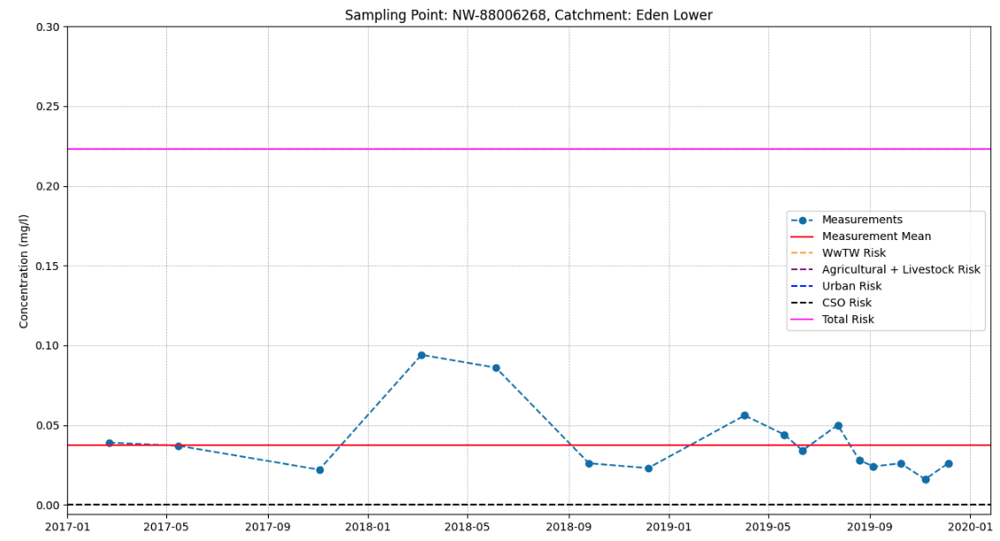

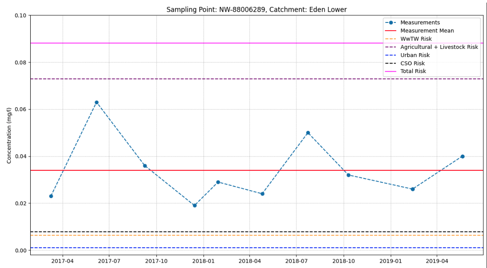

### Ammoniacal Nitrogen

For Ammoniacal Nitrogen, data from EA Sondes were used, which have a high frequency of measurements. However, there are not many catchments for which there are a lot of sondes in the catchment. This is a limitation of this validation as there was very little open high spatial and temporal frequency data available for Ammoniacal Nitrogen. Four catchments were chosen to be validated. These are:

| Operational Catchment/Water body Name | River Body Name | Management Catchment Name     |
| ------------------------------------- | --------------- | ----------------------------- |
| Rede                                  | Rede            | Tyne                          |
| Nidd Middle and Lower                 | Nidd            | Swale Ure Nidd and Ouse Upper |
| Leven                                 | Leven           | Kent and Leven                |
| Ouse Burn                             | Ouse Burn       | Tyne                          |

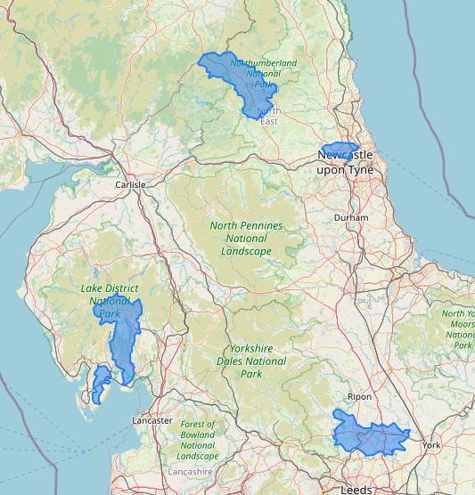

The model over predicts the concentration of ammoniacal nitrogen as well. It is to be noted, however, that ammoniacal nitrogen predicted values are being compared with ammonium nitrogen measurements, and ammoniacal nitrogen incorporates both ammonia and ammonium nitrogen. This means that the actual ammoniacal nitrogen values will be slightly higher than the ammonium measurements. However, given that we can expect ammonia nitrogen to make up at most 10% of ammoniacal nitrogen under typical pH of English rivers, this difference does not explain some of the large discrepancies between the estimated concentrations of ammoniacal nitrogen and EA measures of ammonium nitrogen.

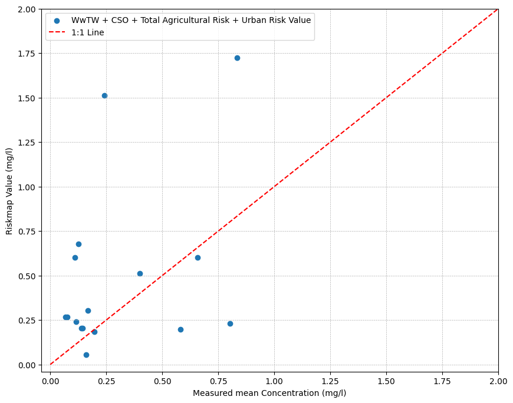

#### Case Study - Leven

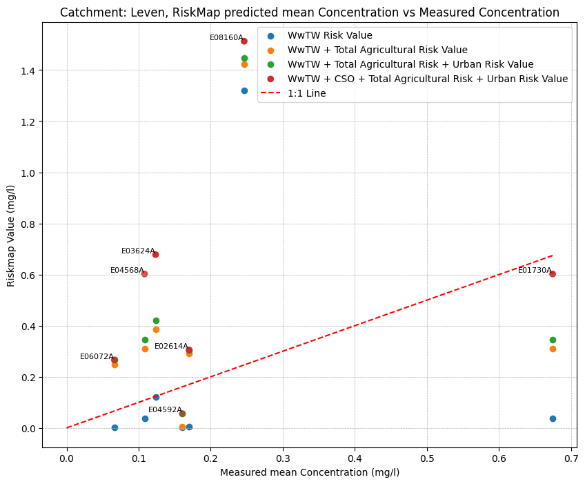

The predicted values generally align with the observed mean values. However, there is one point where the model is significantly over-predicting the ammoniacal N values. This is due to an overestimation of the WwTW Risk due to a large Dry Weather Flow and no consented ammoniacal N value.

This can be seen below: the risk contribution from the other three sources (i.e. the dashed burgundy line) is very close to the actual mean value. It should also be noted that the measurement point is downstream of a large lake (Windermere), which would disrupt a lot of the assumptions being made in the model about flow rate and pollutant decay.

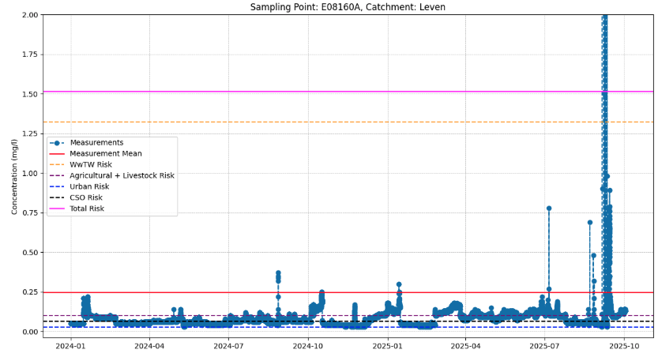

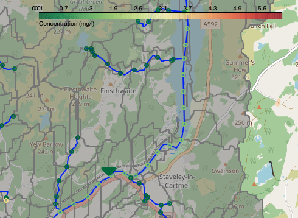

For other points however, the model appears to be capturing the baseline concentrations well even if it is sometimes over predicting the actual mean value.

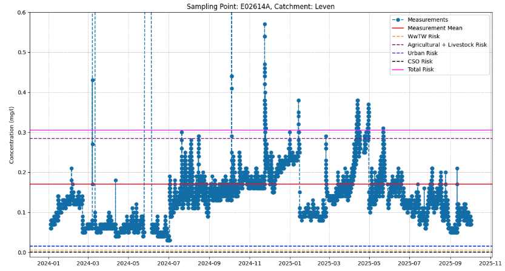

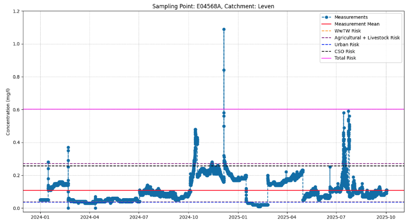

#### Case Study - Ouse Burn

In the case of Ouse Burn, RDMAI placed SONDEs were used to validate the model. The data range is only from June to October 2025, which is not a long period, but it does give some indication of how the model is performing. As seen below, the mean value of ammoniacal N in this catchment is under predicted.

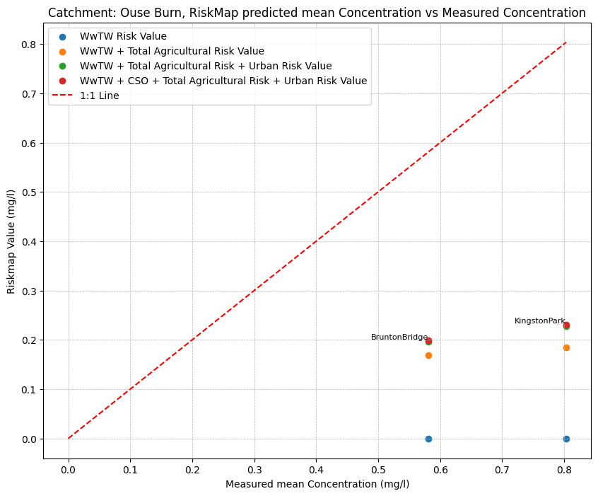

As seen in the timeseries below, the baseline concentration is being captured well, but the model cannot account for the spikes in the measurements very well. This is not very informative however, as the data that the model uses is yearly average data from 2024, and comparing the yearly averaged model output to a period of a few months in 2025 does not account for seasonal averaging. However, it does provide a sanity check for the model.

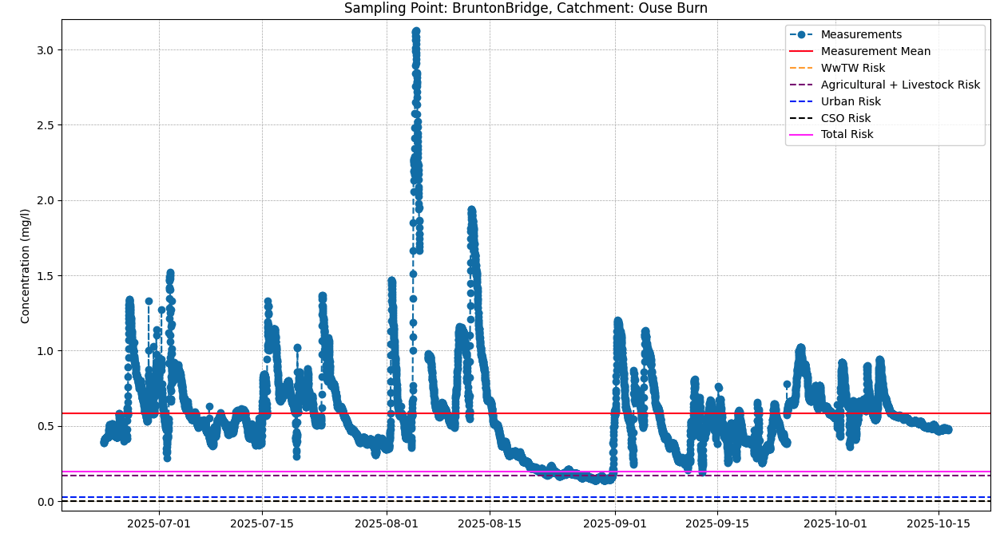

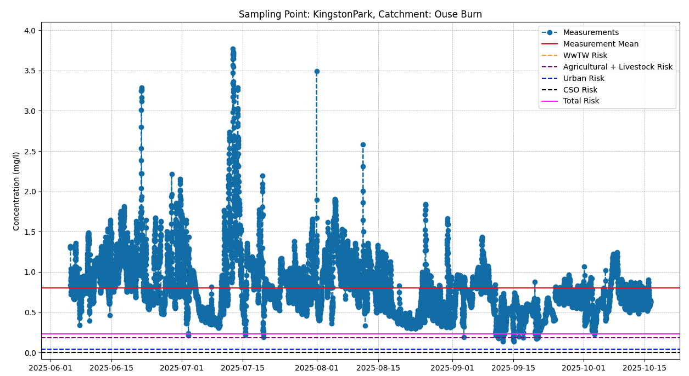

### Flow Measurements

Since a simple assumption for flow is being used in the risk maps, in which flow is estimated according to a regression using upstream accumulated river length, it was possible that flow is a significant contributor to the discrepancies between the predicted and observed values. This is because flow acts to dilute pollutant loads coming into the river from various sources. For the validation of the model for reactive orthophosphate P, some of the EA water quality monitoring points were in close proximity to [National River Flow Archive](https://nrfa.ceh.ac.uk/) flow gauges. For these points of the validation, the Q50 gauged flow was used instead of the simple flow estimation based on the regression using upstream accumulated river length.

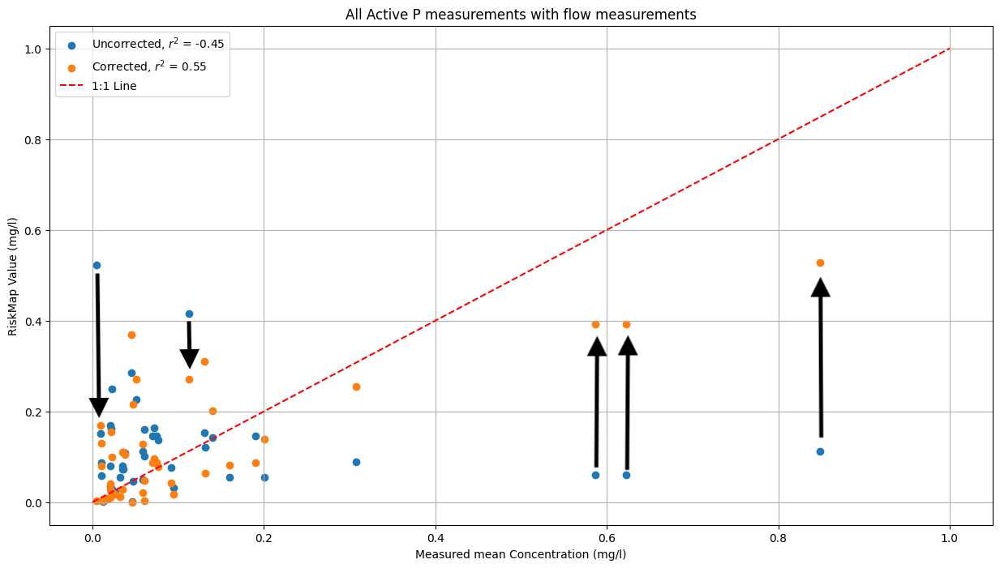

As shown in the figure above, using gauged flow ($n=43$) instead of estimated flow does improve the results considerably. This is to be expected since the method of flow estimation used in the model is very rudimentary. However, it should be noted that gauged flow data is not available at every point in the river network, so this method cannot be used to improve the model everywhere. An improved flow estimation method would be required, which could increase computational overhead, or outside estimations of flow, such as QUBE, would need to be input into the model.

## Limitations of the model

The model has a number of methodological limitations. This model is, by design, simplistic, since it is not designed to replace hydrological/water quality modelling. There are several components of the model that can be improved, but these improvements are not essential for the model to be useful.

- Rivers
  - The flow approximation is very rudimentary and could be improved by using a more sophisticated method, or simulations of flow from another method could be input into the model, such as the [RDMAI Open Flow Model](https://github.com/Cognizant-RDMAI/Open-Flow-Model) or QUBE flows. The simple flow estimation used in the risk maps was shown to have a considerable effect in the validation, in which the use of gauged flow significantly improved the model performance. Therefore, there is a strong argument for improving the flow estimation in the risk maps, either through the input of flow estimations from another method, or improving the estimation of flow in the model itself. However, in the case of the latter, it should be noted that flow estimates would be needed at every node in the river network, possibly leading to high computational overheads.
  - The river flow speed is assumed to be the same for all rivers. Improving the estimation of flow speed is perhaps beyond the scope of the risk maps, and would require considerations of channel shape and width as well as flow level at each node in the river network.
  - The river network implemented in the risk maps is based on the ORN dataset, which is missing some small watercourses. These smaller water courses could be included by using a river network dataset with a finer spatial resolution.
  - The pollutant decay coefficients are very simplistic and do not consider other important factors such as retention or remobilisation.
  - A method to handle cases of lakes or reservoirs could be implemented to improve the model in these areas.

- WwTWs and CSOs
  - There are a number of WwTWs and CSOs which do not have consent conditions in the EA Consents database. This leads to a large uncertainty in the load generated by these assets. However, the risk maps presented are based on open data, and these overestimations could be avoided by incorporating water company data for these assets.
  - The method of estimating spill volume from WwTWs and CSOs can also similarly be improved by incorporating water company data.
  - Currently, WwTWs and CSOs are mapped to the nearest point in the river network. Consequently, these mappings can sometimes not be hydrologically sensible, and incorporating site-specific knowledge can improve these mappings.
  - For CSOs, only the annual data is used. It is therefore assumed that the spill duration is evenly distributed throughout the year.
  - Overflow spill volumes have been estimated based on their consented pass forward flow values, which is a crude method and may not represent reality.

- Agriculture
  - The livestock distribution is assumed to be uniform across a catchment. Site-specific knowledge could be used to make a better approximation. Livestock data are from 2019.
  - Land use information is from the most recent available open source data set 2023.
  - The coefficients are derived from the Farmscoper model, which has a simple soil classification which may not be representative of the specific soils within a catchment.

- Urban Runoff
  - Road widths are estimated using data from OpenStreetMap and Google Earth. If more accurate datasets can be identified, which are preferably open, this aspect of the model can be improved.
  - It is assumed that all urban areas drain directly to the river. Large proportions of urban areas are often connected to the combined sewer network, thereby contributing to CSO discharges and WwTW final effluent. In the future, some reasonable assumptions could be implemented to improve this estimation.
  - It is assumed that runoff from all rural buildings drain to soakaways. This is not always the case. However, avoiding this assumption would require site-specific knowledge or a more accurate dataset.

- Geographical Coverage
  - As previously mentioned, the model currently only covers England. As each nation in the UK has different regulators and ways of storing and sharing data, future work could incorporate them comparably and meaningfully into the model.

  - For instance, data for WwTW and CSO overflows for Wales are stored in a similar format to England, but the [Crop Map of England (CROME)](https://www.data.gov.uk/dataset/be5d88c9-acfb-4052-bf6b-ee9a416cfe60/crop-map-of-england-crome-2020), is only available for England, so for agricultural sources of pollution in Wales, an alternative but comparable method would need to be developed.

- Time scales
  - The model is limited in resolution by the temporal resolution of the input datasets. For instance, the CSO spill data is annual, so the model is limited to annual average concentrations. The rainfall data is also annual average rainfall data. It also assumes that land use has been constant, and agricultural risk is taken from an annual average model.
  - If higher resolution, more frequent data were available, it could be used to improve the model to be more dynamic and capture seasonal (or monthly) variations.

- Not directly linked to measured data
  - While measured data is used to validate the model and establish the assumptions (i.e. fill values), it is not used to calibrate the model outputs.
  - This presents a technical challenge of collecting the data, cleaning it, apportioning it to different sources and then to backpropagate the loads to the sources in the model. This method would also be getting very close to a water quality model, which is not the purpose of this model.
  - Alternatively, a machine learning method like gaussian processes could be used to attach certainty intervals to the riskmap using the measured data.
- Only open-source data has been used
  - This risk map has been constructed using only open-source data. This means that anyone can run the model, but there may be better data sources that could be used to improve the accuracy of the model.
  - For instance, most water companies do not report on their treated flow data, with the exception of [Southern Water](https://www.southernwater.co.uk/about-us/environmental-performance/healthy-rivers-and-seas/flow-and-spill-reporting/_). Therefore we have not included this in our model, but should a user only be interested in the south east of England, use of this data could improve model accuracy (as rather than using DWF consent data, they could use measured treated flow data).

- Output format
  - The output format is currently a static map. This is useful for visualising the risk, but it is not possible to extract the data for further analysis. Future work could include exporting the data in a format that can be used in GIS software or other analysis tools.
