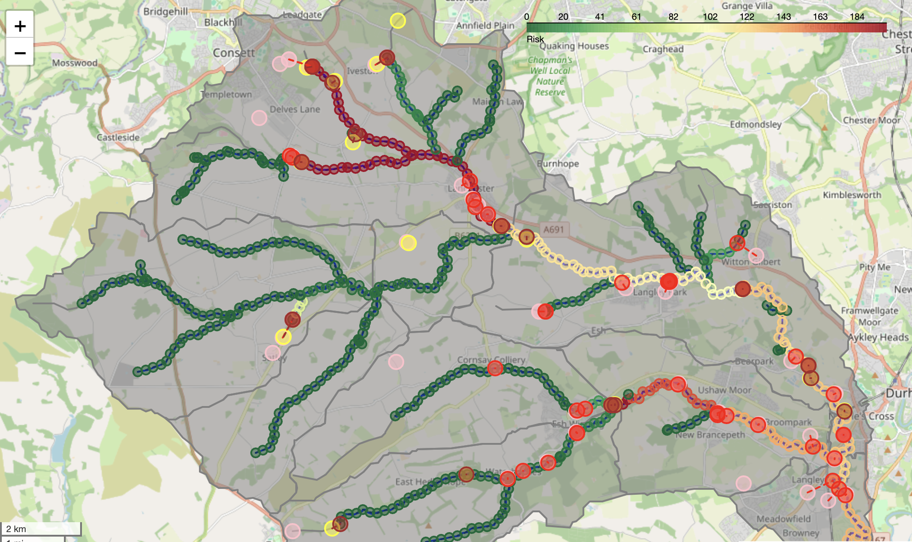
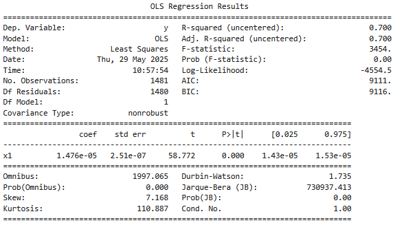
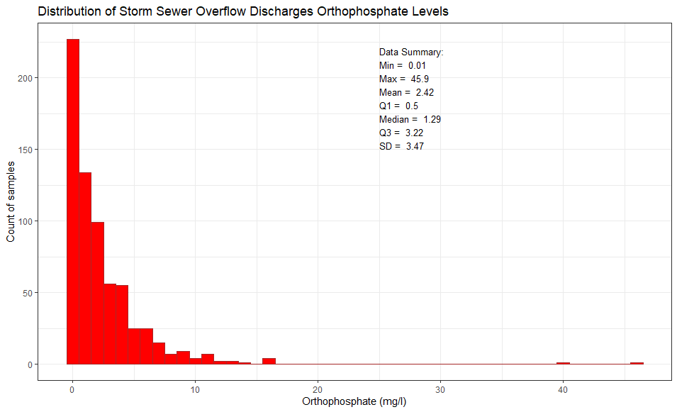
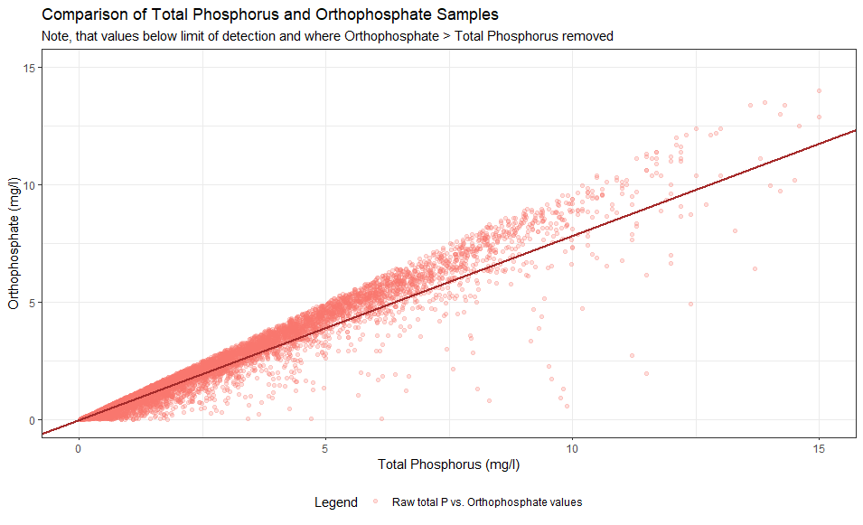
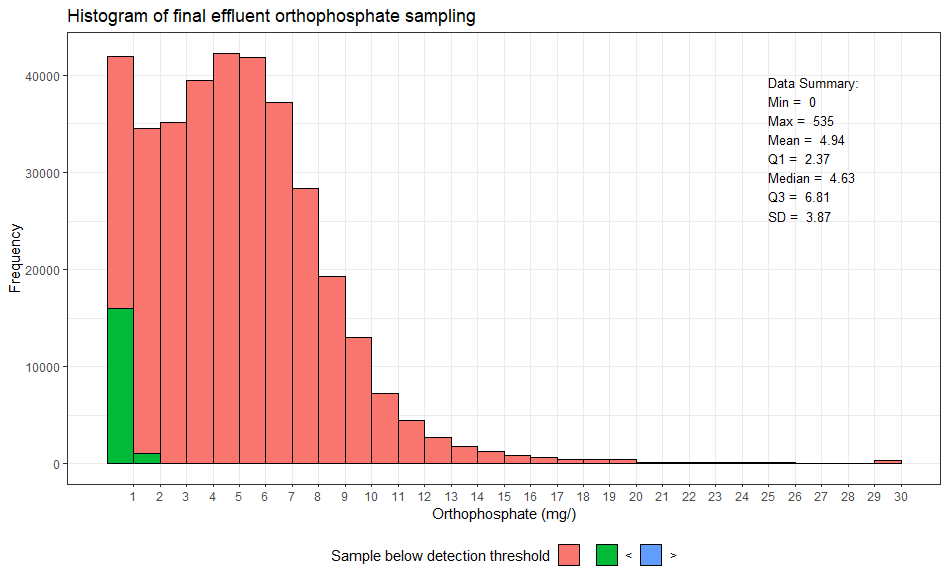

# Risk Map Methodology

- [Risk Map Methodology](#risk-map-methodology)
  - [Motivation](#motivation)
  - [Identifying Important Pressures](#identifying-important-pressures)
  - [Model Description](#model-description)
  - [Overview](#overview)
  - [Data Sources](#data-sources)
    - [Rivers](#rivers)
    - [Overflow Data](#overflow-data)
    - [Consents Data](#consents-data)
  - [Methodology](#methodology)
    - [Mapping the Point Sources of Pollution to Rivers](#mapping-the-point-sources-of-pollution-to-rivers)
    - [Calculating a Risk Value](#calculating-a-risk-value)
      - [Active Phosphorus Risk](#active-phosphorus-risk)
      - [Risk Degradation](#risk-degradation)
      - [River Flow](#river-flow)
      - [Reactive Phosphorus Load](#reactive-phosphorus-load)
        - [CSO Overflows](#cso-overflows)
          - [Phosphorus Load](#phosphorus-load)
          - [Volume](#volume)
          - [Risk Estimation from CSO Overflows](#risk-estimation-from-cso-overflows)
        - [WwTWs](#wwtws)
          - [Phosphorus Load](#phosphorus-load-1)
          - [Volume](#volume-1)
          - [Risk Estimation from WwTWs](#risk-estimation-from-wwtws)
  - [Validation](#validation)
  - [Future Improvements](#future-improvements)
    - [Risks](#risks)
    - [Methodological Limitations](#methodological-limitations)
    - [Geographical Coverage](#geographical-coverage)

## Motivation

Water companies, catchment managers and other stakeholders face significant time and financial outgoings when attempting to design and implement water quality monitoring schemes within a catchment. Furthermore, it can be challenging to determine which sources of pollution represent the highest risk at different locations within a catchment, without prior water quality monitoring.

A risk map generated for the Browney catchment with CSOs and Waste Water Treatment works:

To address these challenges, River Deep Mountain AI is providing a standardised and open approach to produce catchment-wide 'risk maps', helping to highlight areas where pollutants (e.g. phosphorus) pose a higher threat to river water quality. Our Open Risk Map can be used to inform where further on-the-ground walkovers may be needed and highlight the optimal locations for targeting investigations and monitoring.

## Identifying Important Pressures

To identify the most important pressures affecting river catchments in the United Kingdom, the Environment Agency’s (EA's) Reasons for Not Achieving Good Status (RNAGS) were examined. Specifically, how often the different RNAGS appear across England, as shown in the figure below. Those appearing more often were prioritized for inclusion in risk mapping. Whilst this analysis was undertaken only for England, there is not expected to be significantly different pressures in the other nations in the United Kingdom.

This building block focused primarily on catchment pressures that introduce priority pollutants to rivers, as a main objective of the building block is to inform the placement of water quality sensors. Therefore, some of the pressures shown in the figure are not applicable, such as ‘Other’, as they mostly impact river health by physically modifying the channel. The catchment pressures that will be included in the model are divided into those that have been implemented in this phase, those that will likely be implemented in the subsequent phases, and those that will be implemented if time allows:

Summary of most frequently appearing Reasons for Not Achieving Good Status (RNAGS) across England.

Out of these, the following RNAGs have been chosen to be implemented:

- Sewage discharge (continuous), i.e. Wastewater Treatment Works (WwTWs) final effluent discharges
- Sewage discharge (intermittent), i.e. Overflow spills

These were chosen because they are frequently cited as RNAGS and there is a significant overlap of methodology for estimating and mapping the risk to rivers. The points of entry of these risks to the river network can also generally be identified. [Other risks](#risks) are to be implemented in the next phase of the project.

## Model Description

This model creates a map of water quality risk along a watercourse. Risk to a watercourse is calculated by:

- Estimating the quantity of pollutant (in this first iteration, reactive phosphorus) generated by a pollution source (e.g. an overflow).
- Establishing where the pollutant enters the watercourse.
- Estimating the flow of the watercourse at that point.
- Calculating the dilution of a given pollutant in the watercourse (including any pollutants arriving from upstream).
- Comparing the estimated concentration of the pollutant against relevant UKTAG/EQS standards to establish the relative risk from that pollutant at that point in the river.
- Degradation of the pollutant in the watercourse. Different pollutants degrade at different rates.
- The risk from pollution sources is annualised, with the flow estimate used being the Q50 (flow rate equalled or exceeded 50% of the time). This flow estimate is used as risk is estimated according to the UKTAG/EQS standards, which are for annual average values.

At present, the risk model only works for England, and only WwTW and CSO overflow risk has been included. However further pollution sources are to be implemented in future phases. In future iterations, improvements the model coverage will also be made. See [future improvements](#future-improvements).

## Overview

Building block 2C of the River Deep Mountain AI project is related to estimating and mapping water quality risk along rivers [(see Ofwat info page on RDMAI)](https://waterinnovation.challenges.org/winners/river-deep-mountain-ai/). The methodology at a high level is:

1. Building a graph from the rivers and separating river reaches into segments separated by nodes (topological analysis).
2. Ingesting data for the risk layers (these are the sources of our pollution/risks).
3. Mapping the point sources to the rivers.
4. Calculating a risk value for each source.
5. Using the risk value, distance, and flow to estimate a risk at each point in the graph.

This is done progressively using the [`RiskMap.py`](../RiskMap.py) class to perform these operations on a [NetworkX](https://networkx.org/) graph.

In the following sections, these points are outlined in more detail.

## Data Sources

The following section outlines the data sources used for the risk mapping. It does not include any data that could be used improve risk estimations (such as [QUBE](https://www.hydrosolutions.co.uk/software/qube/) for river flow).

Data download and transformation is handled by the [`get_and_transform_data.py`](../get_and_transform_data.py) file. The data are stored in the [data](../data/) directory.

### Rivers

- For rivers, the [Open River Network](https://openrivers.net/) (ORN) is used to give the river network.

- This map is composed of LineStrings which represent river reaches. The river reaches are generally ordered in flow direction (except for tidal rivers) and the river map is considered to be a directed graph.

- The lines are subdivided into a desired resolution to form the nodes of the graph (see [`split_rivers`](../utils/rivers.py)). At present, the resolution is set to 200 m.

### Overflow Data

- Overflow spill data comes from [EA Storm Overflows - Annual Returns](https://environment.data.gov.uk/dataset/21e15f12-0df8-4bfc-b763-45226c16a8ac).

- Each overflow has a unique ID and a Consent Permit Reference, which is used to match to the relevant permit in [EA Consents Database](https://www.data.gov.uk/dataset/55b8eaa8-60df-48a8-929a-060891b7a109/consented-discharges-to-controlled-waters-with-conditions1).

### Consents Data

- Consents data comes from the [EA Consents Database](https://www.data.gov.uk/dataset/55b8eaa8-60df-48a8-929a-060891b7a109/consented-discharges-to-controlled-waters-with-conditions1)
- The relevant tables from this database are:
  - "consents_active": This table contains the active consents with their permit number and location. The WwTWs are located using this table and it is also used to join permit numbers with the determinand.
  - "determinands": This table contains the consented values of the determinands for a given permit number. This is where the conditions for consented effluent phosphorus etc. are obtained.

## Methodology

### Mapping the Point Sources of Pollution to Rivers

Since WwTW and overflow outfall locations are not always situated directly adjacent to the receiving watercourse, outfalls are mapped to the closest river. This is defined in the [`RiskMap.add_point_info_to_map()`](../RiskMap.py) method.

- A tolerance limit (threshold distance) is defined for mapping the points. This tolerance limit can be changed before running the model.
- The points are mapped to the closest point on the river if they are within the tolerance limit (i.e. if the distance of an outfall from the nearest watercourse exceeds the tolerance limit, it will not be mapped), as per the figure below, where a number of points are not mapped to a river reach, as they are situated outside of the threshold.
- By default, the tolerance is set to 700 m, but this can easily be adjusted. The ORN represents each river as a LineString along its centre, and so there is no account for river width. 700 m tolerance allows for overflows neighbouring the largest rivers (e.g. Severn, Thames, which are > 1,000 m wide at their mouths) to match to their respective LineString.

### Calculating a Risk Value

Currently, risk mapping focuses on reactive phosphorus (P) when estimating risks. This simplifies the initial process of developing risk maps and also because phosphorus is a priority pollutant (as the most common "class_item" specified in RNAGS), and is introduced by the different pressures implemented to date. At future stages, further water quality variables may be included into risk mapping, such as ammonia/nitrogen (N) or dissolved oxygen/biological oxygen demand (BOD).

The risk mapping calculates a static estimate of risk, i.e., it does not consider changes in risk across the year. Therefore, the estimate of risk is a representative average for across a year. This approach was taken as the primary aim of the risk mapping is showing a spatial representation of risk. This also means that the risk maps will need to be periodically re-created with updated data to account for changes in risk metrics.

#### Active Phosphorus Risk

After obtaining the estimated yearly average active phosphorus load, this is converted into a concentration at every point.

$$C_P(mg/l) = \frac{\sum{Load_P}}{Flow\ rate}$$

Once this concentration is calculated, it is converted to a risk value using the [UKTAG Revised standards for poor river health](https://www.wfduk.org/sites/default/files/Media/UKTAG%20Phosphorus%20Standards%20for%20Rivers_Final%20130906_0.pdf):

$$Risk = \frac{C_P}{C_{UKTAG}(0.87mg/l)} \times 100$$

This gives a risk value which can be compared to other pollutants.

#### Risk Degradation

The break down of a pollutant is also modelled. Pollutant break down is modelled as an exponential decay with regards to time, calculated using flow speed.

$$c = c_0e^{-\frac{kx}{u}}$$

Where $C_0$ is the initial concentration, $k$ is the decay rate, $x$ is the distance and $u$ is the flow velocity of the river.

For phosphorus, degradation rate is obtained from WRc's in-house integrated catchment model SIMPOL-ICM $(0.05 d^{-1})$ and adjusted for a summer water temperature of $(16^{\circ}C)$ to give an adjusted decay rate of $(0.04d^{-1}).$

Flow velocity was assumed to be constant and calculated using an equation with a simplified trapezoidal representation of a channel profile. Flow levels corresponding to Q50 (flows equalled or exceeded 50% of the time) were examined for gauged points in five case study catchments representative of different regions of England, based on measured values available in the Hydrological Data Explorer. The Q50 flow levels (m), river slopes, and river widths for the five catchments were input into the equation assuming a [Manning's roughness](https://pubs.usgs.gov/wsp/2339/report.pdf) coefficient of 0.03. The calculated flow velocities ranged from 0.47 m/s to 1.04 ms, and an average flow velocity of 0.77 m/s was adopted.

The exponential decay is implemented in [`p_distance_scaling`](../utils/consentsRisk.py).

#### River Flow

River flow is key to understand the dilution capacity of the river at a particular point. A linear approximation with upstream accumulated length (present in ORN) is taken for Q50 flow. This was obtained using a linear regression of flow from [NRFA gauging sites](https://nrfa.ceh.ac.uk/data/search), compared with the nearest point on the ORN. A summary of the regression results is below.

The statistical summary shown indicates that upstream accumulated length (`x1`) from the ORN has a strong relationship with Q50. Adding annual mean rainfall as an independent variable to the regression relationship did not significantly improve the $r^2$ of the regression.

This approximation of Q50 is simplistic and was adopted for convenience and to limit demands of the risk mapping on computational resources. Going forward, the above flow approximation can be replaced with better approximation of flow if available and required, such as [QUBE](https://www.hydrosolutions.co.uk/software/qube/).

The method is implemented in the [`linear_flow()`](../utils/rivers.py) function.

#### Reactive Phosphorus Load

For phosphorus load from water company assets, permit conditions are used to estimate flow and load. As is [common practice](https://www.ciwem.org/assets/pdf/Special%20Interest%20Groups/Urban%20Drainage%20Group/Guide-to-the-Quality-Modelling-of-Sewer-Systems.pdf) for water quality modelling, an event mean concentration is used for pollutants.

The separation of consents into overflows and the mapping of annual overflow spill data to the consents data is performed in the [`get_and_transform_data.py`](../get_and_transform_data.py) file while importing the data. These data are used in the [`utils/consentsRisk.py`](../utils/consentsRisk.py) file to map IDs to a Risk value.

##### CSO Overflows

###### Phosphorus Load

- Overflows do not have permit conditions for phosphorus; therefore, an estimate had to be made.
- Overflow discharges are not normally considered to contribute significantly to phosphorus in watercourses (for instance see the Environment Agency's [source apportionment for the Wye](https://engageenvironmentagency.uk.engagementhq.com/focus-on-phosphorus)), with their impact on dissolved oxygen more significant.
- The concentration of reactive phosphorus in overflow effluent for the purposes of this project is estimated to be $3\,mg/l$.
  - This is based on analysis of the Environment Agency's Water Quality Archive (2000-2024), which indicated a mean orthophosphate value of $2.42\,mg/l$ and a median of $1.29\,mg/l$ for storm sewage overflow discharge samples (n=674, 243 sites).
    
- This value may appear fairly low, considering some WwTW permit conditions for total phosphorus are greater than $3mg/l$, but overflow discharges are generally diluted by run-off:
  - Normal guidance for setting pass forward flow (PFF) values for overflows is roughly 3 x dry weather flow (3DWF) for settled overflows (i.e. storm tanks) and 6 x dry weather flow (6DWF) for non-settled overflows.
  - It would therefore be expected that overflow discharges are diluted (notwithstanding where permits were set before significant upstream development has increased DWF).
  - [Literature](https://www.sciencedirect.com/science/article/abs/pii/0043135476900932) suggests that _per Capita_ production of total phosphorus is around $1.8 g/day$. [Assuming an average _per Capita_ consumption](https://database.waterwise.org.uk/wp-content/uploads/2019/10/WWT-Report-.pdf) of water of $141 l/day$, this gives an average concentration of $12.5 mg/l$ of **Total Phosphorus** in raw sewage (depending on infiltration etc.).
  - Given that this $12.5 mg/l$ should be dilution by between 3 and 6 times before discharge, $3 mg/l$ seems a sensible estimate for orthophosphate in overflow discharges.
- It should be noted that further quality checks on the EA's WQ data have not been undertaken; the data used include all sampling purposes (e.g. compliance audits, unplanned and planned monitoring). No account has been made for weather conditions (and therefore dilution of foul flow) at the time of sampling.

###### Volume

- Current overflow monitoring (Event Duration Monitoring) in the UK is generally limited to duration of spill (and spill count, which uses the Environment Agency's [12/24 counting method](https://www.gov.uk/government/publications/water-companies-environmental-permits-for-storm-overflows-and-emergency-overflows/water-companies-environmental-permits-for-storm-overflows-and-emergency-overflows#counting-spills)). To understand the risk to watercourses posed by overflows, an estimate of spill volume had to be made:
  - Flow is obtained from the **Weir Setting** or **Flow to Full Treatment** given in the permit conditions.
  - Where no weir setting was specified, a value of $20 l/s$ was assumed.
    - This $20\ l/s$ value is a placeholder. Weir settings range from less than $1\ l/s$ to over $27,000\ l/s$ (at Beckton WwTW). _Generally_ , an overflow without a weir setting would be expected to be on the smaller side of this (or permitted to only spill in an emergency), but there is no easy approximation without detailed analysis of sewer records (which are not publicly available). However, this will be reviewed in future phases.
  - The weir setting was assumed to be the average rate of spill for the overflow (i.e. an overflow with a 10 l/s weir setting would be expected to spill 10 l/s on average).
- This method assumes that an overflow with a larger permit setting spills a larger volume. This is a fairly coarse assumption, but estimates of overflow spill volumes are not readily available.
  - To validate this method, a limited check was made of spill volumes predicted by hydraulic models (though not specifically calibrated to predict overflow spills) and of "flow to storm" telemetred flow.
  - The results were highly variable but indicated that the 1:1 weir setting:spill volume ratio may overestimate spill volumes, with spill volumes _tending_ to be lower than the weir setting (dependent obviously on the size of the storm). However, given the very low sample size and confidence in the flow and hydraulic model data, it was decided that a 1:1 ratio was probably an acceptable assumption. **Supporting data for this is not provided as it is not publicly available**.

###### Risk Estimation from CSO Overflows

- To estimate the yearly average load, reactive phosphorus load for a spill is first calculated from:

  $$P_{load} = 3 mg/l * weir\ setting$$

- And subsequently multiplied by the spill duration to acquire the average load.

  $$P_{avg}= P_{load} \times \frac{Spill\ duration(s)}{365 \times 24 \times 60 \times 60}$$

This value can then be divided by the estimated Q50 flow value to obtain the average concentration (noting that Q50 values are in $m^3/s$).

##### WwTWs

###### Phosphorus Load

- Treated sewage (final effluent) is normally consented for total phosphorus, which for risk modelling has been converted to active phosphorus.
- A linear approximation was used to convert total phosphorus to active phosphorus: $$P_{Active} = P_{Total} * 0.785$$ (see [`utils/consentsRisk.py`](../utils/consentsRisk.py)).

  - This figure was derived from the Environment Agency's Water quality data archive.
  - For "final effluent" sample types, the total phosphorus samples were joined with their corresponding orthophosphate samples. Samples taken at the sample point and time were assumed to be the same sample.
  - Any samples were removed that were outside of the detection threshold for either total phosphorus or orthophosphate. Any samples where orthophosphate exceeded total phosphorus were also removed (as this is not possible).
  - A linear model with an intercept forced to 0 was fitted to the transformed paired results. The results of this linear model are presented below, alongside a graphical representation of the results (n = 8,167).
    
    
    

- Not all WwTWs currently have permit conditions set for phosphorus treatment (typically because they don't have P stripping). A value of $5 mg/l$ is used where no phosphorus permit conditions are set. This value was obtained by taking an average of the EA's orthophosphate final effluent samples ($4.94 mg/l$, n = 354,370). These data are primarily from pre-2010 and are summarised below. This value also ties in well with [OFWAT's PR24 performance commitments](https://www.ofwat.gov.uk/wp-content/uploads/2024/12/River-water-quality-_-FD-PC-definition.pdf).
  

###### Volume

- The flow/volume of treated effluent is estimated from the Dry Water Flow (DWF) condition in the permit.
  - Most WwTWs have a permit condition for DWF. A value of $20 m^3/day$ is used in the absence of information. A manual check of these sites tended to indicate that they were very small.
  - $20 m^3/day$ has been used as this is the upper discharge limit of a "Standard Rules" permit [as described by the Environment Agency](https://www.gov.uk/guidance/discharges-to-surface-water-and-groundwater-environmental-permits#apply-for-a-standard-rules-permit).
- The values used for estimating WwTWs final effluent risk could be improved by using _measured_ treated effluent values rather than permit limits, and by incorporating _actual_ phosphate measurements for a WwTW. However, neither of these values were readily available at the time of initial release of this model (though some water companies do publish them, and water companies are required to report their treated effluent volumes to the EA for any site treating > $50 m^3/day$).

###### Risk Estimation from WwTWs

- To estimate the yearly average load:

  $$P_{avg} = (WwTW\ Total\ Phosphorus\ Permit\ Condition * 0.785\ or\ 5mg/l) * DWF\ Permit\ (or\ 20 m^3/day) $$

  This value can then be divided by estimated Q50 flow value to obtain the average concentration (noting that Q50 values are in $m^3/s$).

## Validation

Effectively, this risk map is a simplistic source apportionment tool. Therefore, UKCEH's [SAGIS](https://catalogue.ceh.ac.uk/documents/57c40da0-2dc7-43a1-8291-f9ae2fd0a18d) model is a good starting point for validation. As yet, detailed validation has not been undertaken, as additional pollution sources are needed (e.g., agriculture, highway and urban runoff, etc.) before this is worthwhile doing. However, the model has been sense checked to make sure results are at least logical.

Further validation could be undertaken by checking model results against Water Framework Directive results.

## Future Improvements

This is an initial model to estimate water quality risk. The intention is to include more pollution sources, and improve on some of the methods used. Some of the risks and methodology limitations that are to be addressed are listed below. Including some seasonal estimates in the tool will also be investigated in the next step.

### Risks

The following risks will be added in the next phases of the model:

- Agricultural risk (both arable and livestock).
- Urban/highway run-off risk.
- Private sewage treatment (i.e. septic tanks).
- Trade effluent (potentially).
- Adjustment of risk in the proximity of inland bathing waters.

### Methodological Limitations

The model has a number of methodological limitations. This model is, by design, simplistic. Since it is not designed to replace water quality modelling, some (rather large) limitations remain. Investigation into the following limitations is slated for the next phase:

- Where they lie more than 700 m from an existing watercourse, develop a method to join WwTWs/CSOs to a sensible location on the watercourse (probably using hydrological analysis).
- Develop a better estimate of weir setting, where no weir setting is specified in consent documentation.
- Further investigation into sensible spill volumes to use from overflows.
- Possibly include different pollutants (_E. coli_, BOD, etc.).
- Introduce the opportunity to _simply_ overwrite specific estimates of risk (e.g. overwrite an overflow with actual spill volumes or weir settings - though this is a stretch goal).

### Geographical Coverage

As previously mentioned, the model at the moment only covers England. As each nation in the UK has different regulators and ways of storing and sharing data, it takes time to incorporate them comparably and meaningfully into the model.

For instance, data for WwTW and CSO overflows for Wales are stored in a similar format to England, but the [Crop Map of England (CROME)](https://www.data.gov.uk/dataset/be5d88c9-acfb-4052-bf6b-ee9a416cfe60/crop-map-of-england-crome-2020), is only available for England, so for agricultural sources of pollution in Wales, an alternative but comparable method will need to be developed.
